|image|creator|title|description|
|---|---|---|---|
|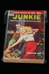|William S. Burroughs|Junkie|New York: Ace Books, Inc., 1953. First. Not as much yellowing as is typical. Schottlaender A1a, Maynard & Miles A1a.|
|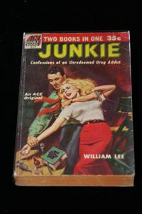|William S. Burroughs|Junkie|New York: Ace Books, Inc., 1953. First. Signed by Burroughs, dated "Nov. 6, 1985". Yellowing and fragile, bookseller's sticker on inside front cover. Schottlaender A1a, Maynard & Miles A1a.|
|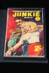|William S. Burroughs|Junkie|London: Digit Books, 1957. First English. In custom clamshell case. Schottlaender A1b, Maynard & Miles A1b.|
|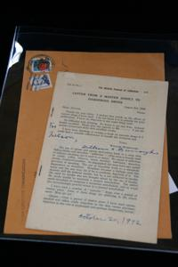|William S. Burroughs|British Journal of Addiction 53(2)|n.p., 1957-01. Offprint of Burroughs' article "Letter From A Master Addict To Dangerous Drugs." Limited to 50 copies. Signed by Burroughs, inscribed to Nelson Lyon "For Nelson, William S. Burroughs October 20, 1992." With postmarked envelope with William Burroughs Communications return address. Schottlaender C3, Maynard & Miles C1b.|
|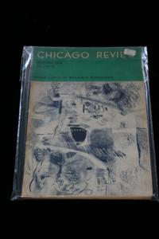|William S. Burroughs|Chicago Review 12(3)|n.p., 1958. Soiled and worn on the spine. Schottlaender C5, Maynard & Miles C5.|
|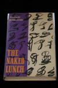|William S. Burroughs|The Naked Lunch|Paris: The Olympia Press, 1959. First. Signed by Burroughs. With slight chipping and tearing on dust jacket spine. Schottlaender A2a, Maynard & Miles A2a.|
|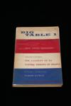|William S. Burroughs|Big Table 1|n.p., 1959.  Schottlaender C7, Maynard & Miles C6.|
|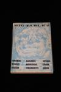|William S. Burroughs|Big Table 2|n.p., 1959.  Schottlaender C8, Maynard & Miles C7.|
|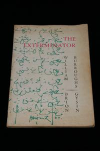|William S. Burroughs|The Exterminator|San Francisco: The Auerhahn Press, 1960. First. Yellowing on edges. Schottlaender A3a, Maynard & Miles A4a.|
|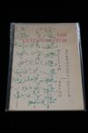|William S. Burroughs|The Exterminator|San Francisco: The Auerhahn Press, 1960. First. Little yellowing. Schottlaender A3a, Maynard & Miles A4a.|
|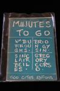|William S. Burroughs|Minutes To Go|Paris: Two Cities Editions, 1960. First. Slightly soiled wrappers with wear on spine. Schottlaender A4a, Maynard & Miles A3a.|
|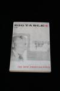|William S. Burroughs|Big Table 4|n.p., 1960.  Schottlaender C14, Maynard & Miles C16.|
|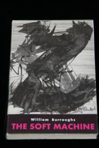|William S. Burroughs|The Soft Machine|Paris: The Olympia Press, 1961. First. Schottlaender A5a, Maynard & Miles A5a.|
|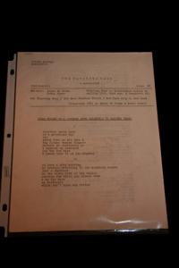|William S. Burroughs|The Floating Bear 5|n.p., 1961.  Schottlaender C24, Maynard & Miles C31 and C32.|
|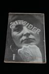|William S. Burroughs|The Outsider 1|n.p., 1961.  Schottlaender C33, Maynard & Miles C35.|
|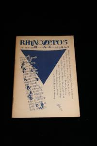|William S. Burroughs|Rhinozeros 5|n.p., 1961.  Schottlaender C34, Maynard & Miles C38.|
|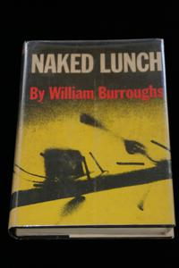|William S. Burroughs|Naked Lunch|New York: Grove Press, Inc., 1962. First American. Schottlaender A2b, Maynard & Miles A2b.|
|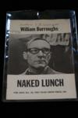|William S. Burroughs|From Naked Lunch|New York: Grove Press, Inc., 1962. Pre-publication brochure for Naked Lunch Grove Press edition. Signed and dated "12/18/87" by Burroughs. Schottlaender A2b1, Maynard & Miles F7.|
|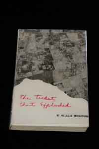|William S. Burroughs|The Ticket That Exploded|Paris: The Olympia Press, 1962. First. Schottlaender A6a, Maynard & Miles A6a.|
|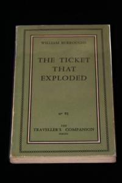|William S. Burroughs|The Ticket That Exploded|Paris: The Olympia Press, 1962. First. Signed by Burroughs, inscribed "For Ralph", without dust jacket. Schottlaender A6a, Maynard & Miles A6a.|
|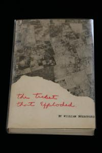|William S. Burroughs|The Ticket That Exploded|Paris: The Olympia Press, 1962. First. Signed by Burroughs. With slight yellowing on dust jacket. Schottlaender A6a, Maynard & Miles A6a.|
|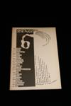|William S. Burroughs|Rhinozeros 6|n.p., 1962.  Schottlaender C44, Maynard & Miles C43.|
|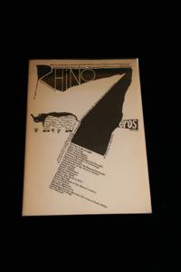|William S. Burroughs|Rhinozeros 7|n.p., 1962.  Schottlaender C45, Maynard & Miles C45.|
|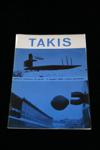|William S. Burroughs|Takis|n.p., 1962.  Schottlaender G89, Maynard & Miles F5.|
|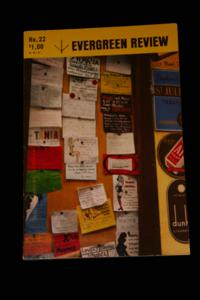|William S. Burroughs|Evergreen Review 6(22)|n.p., 1962-01.  Schottlaender C38, Maynard & Miles C39.|
||William S. Burroughs|Dead Fingers Talk|London: John Calder, 1963. First. Schottlaender A7a, Maynard & Miles A7a.|
|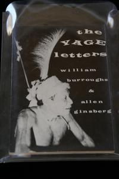|William S. Burroughs, Allen Ginsberg|The Yage Letters|San Francisco: City Lights Books, 1963. First. Schottlaender A8a, Maynard & Miles A8a.|
|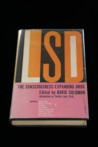|David Solomon|LSD: The Consciousness-Expanding Drug|New York: Putnam, 1964. First. Personal copy of Owsley Stanley, signed by Stanley. Maynard & Miles B15a.|
|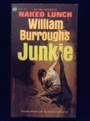|William S. Burroughs|Junkie|New York, NY: Ace Books, 1964. First American, first state. Schottlaender A1c, Maynard & Miles A1c.|
|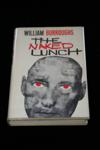|William S. Burroughs|The Naked Lunch|London: John Calder, 1964. First English. Schottlaender A2d, Maynard & Miles A2c.|
|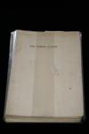|William S. Burroughs|The Naked Lunch|London: John Calder, 1964. First English. An advance copy in the form of unbound signatures, uncut. Fingermarks, slightly soiled. Schottlaender A2d, Maynard & Miles A2c.|
|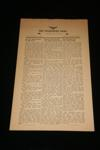|William S. Burroughs|The Coldspring News|Flint, MI: Fenian Head Centre Press, 1964. First. Per Brewer's Books: "This is one of the separately issued copies with no fold creases. Newsprint very tanned penciled price in upper right hand corner as it was sold in some bookstores in the '60's for ten cents each. ... No copyright at lower edge which according to Maynard and Miles (C124c) means it is a 'later state' ..." Schottlaender A9, Maynard & Miles C124c.|
|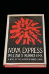|William S. Burroughs|Nova Express|New York: Grove Press, Inc., 1964. First. Tear on spine of dust jacket. Schottlaender A10a, Maynard & Miles A10a.|
|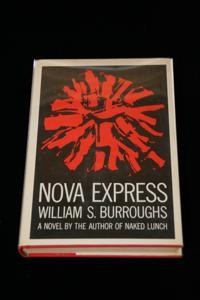|William S. Burroughs|Nova Express|New York: Grove Press, Inc., 1964. First. Signed by Burroughs, inscribed "For Gerald Holsinger with all best wishes William S. Burroughs July 27, 1965 New York". Schottlaender A10a, Maynard & Miles A10a.|
|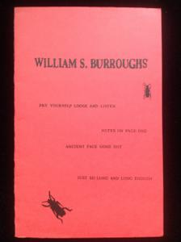|William S. Burroughs|Pry Yourself Loose And Listen|Tangier, Morocco: Ira Cohen, 1964. First. In wrappers. Schottlaender A11.|
|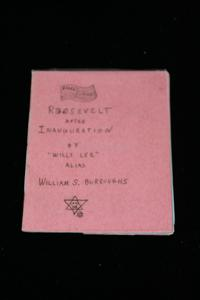|William S. Burroughs|Roosevelt After Inauguration|New York: Fuck You Press, 1964. First. Schottlaender A12, Maynard & Miles A9a.|
|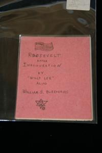|William S. Burroughs|Roosevelt After Inauguration|New York: Fuck You Press, 1964. First. Signed by Burroughs and Allen Ginsberg, dated "1978" by Ginsberg. Schottlaender A12, Maynard & Miles A9a.|
|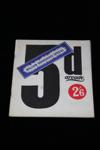|William S. Burroughs|Arcade 1|n.p., 1964. First state. Schottlaender C65, Maynard & Miles C84, C85, and C86.|
|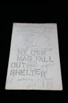|William S. Burroughs|My Own Mag 9|n.p., 1964-11-01.  Schottlaender C89, Maynard & Miles C101.|
|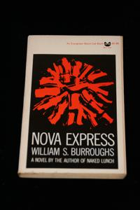|William S. Burroughs|Nova Express|New York: Grove Press, Inc., 1965. Second, sixth printing. Wrappers partially separated from spine. Schottlaender A10b, Maynard & Miles A10b.|
|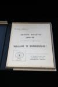|William S. Burroughs|Health Bulletin: APO-33, A Metabolic Regulator|New York: Fuck You Press, 1965. First. From James Musser's description: "Mimeographed sheets, stapled at the edge. The correct first edition. The legendarily rare Fuck You Press edition of this title published by Ed Sanders who abandoned the project before completion. According to Sanders "maybe as many as ten or twenty" copies were distributed before he halted publication due to Burroughs' dissatisfaction with the copy he'd received. Maynard and Miles state that "a good early copy was secured by Bill Beckman," and that is the copy offered here. Bill Beckman was an artist from Texas who designed album covers for The Fugs, and a good friend of Sanders who regularly gave him copies of current Fuck You Press publications. This copy bears Beckman's ownership signature on the title page. If only 10 or 20 copies did exist originally, far fewer have been accounted for. We know of only 3 copies in private hands, NUC and WORLDCAT turn up no copies in institutions (though there is a copy at Northwestern), and we've never seen a copy offered for sale. The cover sheet has pulled loose from two staples, else fine with all of the illustrations pasted in. Housed in a handsome clamshell box." Schottlaender A13a, Maynard & Miles A12a.|
|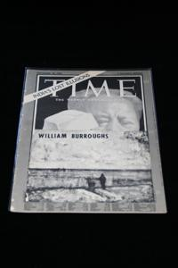|William S. Burroughs|Time|New York: "C" Press, 1965. First. Number 91 of 100, signed by Burroughs and Gysin. Some wear on spine. Schottlaender A15a, Maynard & Miles A11a.|
|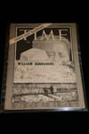|William S. Burroughs|Time|New York: "C" Press, 1965. First. Signed by Burroughs and Brion Gysin, who contributed four drawings. Number 22 of 100, some yellowing and wear on spine. Schottlaender A15a, Maynard & Miles A11a.|
|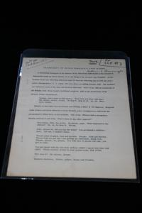|William S. Burroughs|Valentine's Day Reading|New York: The American Theatre for Poets, 1965. First. Per James Musser: "Program distributed on the occasion of Burroughs' appearance at the East End Theatre in New York, 1965, for a Valentine's Day reading sponsored by The American Theatre for Poets.  Prints "Transcript of Dutch Schultz's Last Words" and "The Coldspring News."  This is Lawrence Ferlinghetti's copy with the notation "Save for CLJ #3" in Ferlinghetti's hand.  Ferlinghetti was apparently going to include this piece in City Lights Journal #3, but decided against it.  Signed by William Burroughs." These are pages 1 through 6, lacking the cover sheet and page 7 ("The Coldspring News"). Schottlaender A16, Maynard & Miles F12.|
|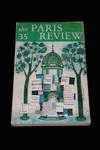|William S. Burroughs|Paris Review 35|n.p., 1965. Signed by Burroughs at entry. Schottlaender C119, Maynard & Miles C127 and E3.|
|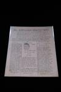|William S. Burroughs|The Marijuana Newsletter 1|n.p., 1965-01-30.  Schottlaender C107, Maynard & Miles C103.|
|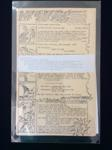|William S. Burroughs|My Own Mag 11|n.p., 1965-02.  Schottlaender C113 and C110, Maynard & Miles C105, C106, C107, and C108.|
|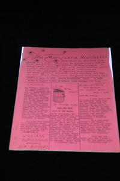|William S. Burroughs|The Marijuana Newsletter 2|n.p., 1965-03-15.  Schottlaender C108, Maynard & Miles C110.|
|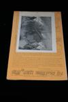|William S. Burroughs|My Own Mag 12|n.p., 1965-05.  Schottlaender C114 and C96, Maynard & Miles C112 and C113.|
|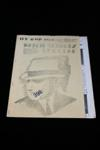|William S. Burroughs|My Own Mag 13|n.p., 1965-08. Limited. Numbered 398 of 500. Schottlaender C115, Maynard & Miles C122.|
||William S. Burroughs|My Own Mag 14|n.p., 1965-12.  Schottlaender C116 and C112, Maynard & Miles C131.|
|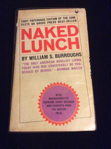|William S. Burroughs|Naked Lunch|New York: Grove Press, Inc., 1966. Second printing. Schottlaender A2e, Maynard & Miles A2d.|
||William S. Burroughs|The Soft Machine|New York: Grove Press, Inc., 1966. First American. Schottlaender A5b, Maynard & Miles A5b.|
||William S. Burroughs|Nova Express|London: Jonathan Cape, 1966. First English. With wording on page 4 blacked out with black magic marker. Schottlaender A10c, Maynard & Miles A10c.|
||William S. Burroughs|APO-33 Bulletin|San Francisco: Beach Books, Texts and Documents, 1966. Second. Some yellowing and chipping of pages. Schottlaender A13b, Maynard & Miles A12b.|
||William S. Burroughs|The Invisible Generation|London: Project Sigma, 1966. First edition thus. 11 3/8" x 17", offset-printed on recto only. Schottlaender C146.|
||William S. Burroughs|East Side Review 1(1)|n.p., 1966-01.  Schottlaender C126, Maynard & Miles C132.|
||William S. Burroughs|My Own Mag 15|n.p., 1966-04.  Schottlaender C142, Maynard & Miles C137, C138, C139, and C140.|
||William S. Burroughs|The Soft Machine|New York: Grove Press, Inc., 1967. First American paperback. Owner's signature, some yellowing. Schottlaender A5c, Maynard & Miles A5c.|
||William S. Burroughs|The Ticket That Exploded|New York: Grove Press, Inc., 1967. First American. Dust jacket slightly torn vertically on back. Schottlaender A6b, Maynard & Miles A6b.|
||William S. Burroughs|The Ticket That Exploded|New York: Grove Press, Inc., 1967. First American. Signed by Burroughs. Dust jacket slightly yellowed. Schottlaender A6b, Maynard & Miles A6b.|
||William S. Burroughs|So Who Owns Death TV?|San Francisco: Beach Books, Texts and Documents, 1967. First. Schottlaender A17a, Maynard & Miles A13a.|
||William S. Burroughs|So Who Owns Death TV?|San Francisco: Beach Books, Texts and Documents, 1967. First (variant). Some creasing in lower left hand corner and close to spine. Schottlaender A17a, Maynard & Miles A13a.|
||William S. Burroughs|So Who Owns Death TV?|San Francisco: Beach Books, Texts and Documents, 1967. Second. Slight evidence of price sticker removal on front wrapper. Schottlaender A17b, Maynard & Miles A13b.|
||William S. Burroughs|Burroughs Pelieu Kaufman|Paris: L'Herne, 1967. First. Number 33 of 40. With uncut pages and with signed and numbered lithograph by Jean Helion laid in. Schottlaender A18a, Maynard & Miles D11.|
||William S. Burroughs, Allen Ginsberg|Les lettres du Yage|Paris: L'Herne, 1967. First French. Presentation copy  inscribed by Burroughs "For Mary Beach and Claude Pelieu William Burroughs" , also signed by Allen Ginsberg "Allen Ginsberg Ah." Schottlaender D143, Maynard & Miles D10.|
||William S. Burroughs|Klacto 23|n.p., 1967-09.  Schottlaender C162, Maynard & Miles C174.|
||William S. Burroughs|Minutes To Go|San Francisco: Beach Books, Texts and Documents, 1968. First American. Owner's signature. Schottlaender A4b, Maynard & Miles A3b.|
||William S. Burroughs|Minutes To Go|San Francisco: Beach Books, Texts and Documents, 1968. First American. Personal copy of Kathy Acker, signed by Acker. Schottlaender A4b, Maynard & Miles A3b.|
||William S. Burroughs|The Soft Machine|London: Calder & Boyars, 1968. First British.  Inscribed by Burroughs to his agent Michael Henshaw "For Michael Henshaw with friendship and best wishes William S. Burroughs." Schottlaender A5d, Maynard & Miles A5d.|
||William S. Burroughs|The Ticket That Exploded|New York: Grove Press, Inc., 1968. Second printing. Inscribed by Burroughs on title page “For Richard Aaron William S. Burroughs." Per Ken Lopez, at one time this was in the collection of Robert and Donna Jackson: "Jackson, a book collector long before he purchased Burroughs' papers, also acquired a number of other copies of Burroughs titles, including ... another group inscribed to Richard Aaron, the bookseller who had helped facilitate the sale of the [Vaduz] archive." Schottlaender A6c, Maynard & Miles A6c.|
||William S. Burroughs|The Ticket That Exploded|London: Calder & Boyars, 1968. First English. Signed by Burroughs, inscribed "For Brad".  I obtained this item from Red Stodolsky of Baroque Books in Hollywood in the late Eighties; I remember Red smiling gnomically when he handed it to me, as if he'd arranged to get it inscribed for me, but I have no real proof that that was the case. Slight tear and rubbing on spine of dust jacket. Schottlaender A6d, Maynard & Miles A6d.|
||William S. Burroughs|APO-33 Bulletin|San Francisco: Beach Books, Texts and Documents, 1968. Third. Second printing of Beach edition. Schottlaender A13c, Maynard & Miles A12c.|
||William S. Burroughs|Apomorphine|Paris: L'Herne, 1969. First. Per James Musser: "Softbound (no hardbound issued). First edition. Prints "Apomorphine" in it's entirety (in three-column style), as well as "Day the Records Went Up," "Coldspring News," "Parenthetically 7 Hertz," and more. Among the scarcer Burroughs items. Fine. (French text.)" Schottlaender A20, Maynard & Miles D14.|
||William S. Burroughs|The Dead Star|San Francisco: The Nova Broadcast Press, 1969. First. Schottlaender A21, Maynard & Miles A14a.|
||William S. Burroughs|The Dead Star|San Francisco: The Nova Broadcast Press, 1969. First. Signed by Burroughs. Schottlaender A21, Maynard & Miles A14a.|
||William S. Burroughs|Fruit Cup 0|n.p., 1969.  Schottlaender C230, Maynard & Miles C243 and C244.|
||William S. Burroughs|Wormwood Review 9, 4(36)|n.p., 1969.  Schottlaender C262, Maynard & Miles C247.|
||William S. Burroughs|Le Ticket Qui Explosa|Paris: Christian Bourgois Editeur, 1969. First French. Wrappers yellowed on spine. Schottlaender D123, Maynard & Miles D13.|
||William S. Burroughs|Entretiens avec William Burroughs|Paris: Editions Pierre Belfond, 1969. First. Inscribed by Burroughs to the dealer and proprietor of Am Here Books, Richard Aaron:  "For Richard Aaron, William Burroughs." Schottlaender H9a, Maynard & Miles A15a.|
||William S. Burroughs|The Soft Machine|London: Corgi Books, 1970. First edition thus. Schottlaender A5e, Maynard & Miles A5f.|
||William S. Burroughs|The Last Words of Dutch Schultz|London: Cape Goliard Press, 1970. First. Some yellowing to dust jacket. Schottlaender A22a, Maynard & Miles A17a.|
||William S. Burroughs|The Last Words of Dutch Schultz|London: Cape Goliard Press, 1970. First. Signed and numbered by Burroughs, 13 of 100. With tissue wraps as issued. Schottlaender A22a, Maynard & Miles A17a.|
||William S. Burroughs|The Braille Film|San Francisco: Nova Broadcast Press, 1970.  Schottlaender G94, Maynard & Miles B55a.|
||Daniel Odier, William S. Burroughs|The Job|New York: Grove Press, Inc., 1970. First. Schottlaender H9b, Maynard & Miles A16a.|
||Daniel Odier, William S. Burroughs|The Job|New York: Grove Press, Inc., 1970. First. Signed by Burroughs, inscribed "To Mike”. Schottlaender H9b, Maynard & Miles A16a.|
||Daniel Odier, William S. Burroughs|The Job|New York: Grove Press, Inc., 1970. First. Uncorrected proof. Comb-bound in slightly soiled faded orange wrappers. Schottlaender H9b, Maynard & Miles A16a.|
||Daniel Odier, William S. Burroughs|The Job|London: Jonathan Cape, 1970. First English. Personal copy of Allen Ginsberg, signed by Ginsberg and Burroughs. Inscribed by Burroughs on title page "For Allen a co worker of many years with respect for his achievements in the cause of freedom William Burroughs 1980". Ownership signature of Ginsberg on obverse of leaf before title page, with notation at bottom "Signed June 12, 1980 by WSB." Publisher's slip ("with compliments from Tom Maschler Jonathan Cape Ltd. 30 Bedford Square London SW1") and postcard (with picture of Ginsberg and Peter Orlovsky copyright Elsa Dorfman and the Witkin Gallery) laid in. Schottlaender H9c, Maynard & Miles A16b.|
||William S. Burroughs|IT: 74|n.p., 1970-02-27.  Schottlaender C280, Maynard & Miles C269.|
||William S. Burroughs|Ali's Smile - Record|Brighton, England: Unicorn Books, 1971. First. A copy of the record with sleeve originally supplied with the book. This copy was purchased from a different source than my copy of the book, so there's no evidence that the two constituted a complete set. Since one would expect complete sets to stay together, it is unlikely that they ever were. But together they form a made-up copy. Schottlaender A23a, Maynard & Miles A19a.|
||William S. Burroughs|Ali's Smile|Brighton, England: Unicorn Books, 1971. First. Signed and numbered by Burroughs, 39 of 99. Unfortunately missing the original box and record. Schottlaender A23a, Maynard & Miles A19a.|
||William S. Burroughs|Electronic Revolution|Cambridge: Blackmoor Head Press, 1971. First. Includes four prints signed by Brion Gysin and publisher's prepublication announcement (Maynard and Miles F27) laid in. Inscribed by Burroughs "for Philip Kaplan Williams Burroughs." Number 10 of 50. In slipcase with numbered label. Schottlaender A24a, Maynard & Miles A21a.|
||William S. Burroughs|Electronic Revolution|Cambridge: Blackmoor Head Press, 1971. First. Schottlaender A24a, Maynard & Miles A21a.|
||William S. Burroughs|Electronic Revolution Prepublication Announcement|Cambridge: Blackmoor Head Press, 1971. First. The prepublication announcement for Electronic Revolution (Maynard and Miles A21a). Schottlaender A24a1, Maynard & Miles F27.|
||William S. Burroughs|Die elektronische Revolution|Bonn: Expanded Media Editions, 1971. First German. Number 11 of 100. Schottlaender A24b, Maynard & Miles D27.|
||William S. Burroughs|Jack Kerouac|Paris: L'Herne, 1971. First. Signed by Burroughs at contribution. Schottlaender A25, Maynard & Miles A18a.|
||William S. Burroughs|The Wild Boys|New York: Grove Press, Inc., 1971. First. Signed by Burroughs. Schottlaender A26a, Maynard & Miles A20a.|
||William S. Burroughs|Antaeus 2|n.p., 1971. Maynard and Miles C304. Signed by Burroughs at entry. Schottlaender C302, Maynard & Miles C304.|
||William S. Burroughs|Letter Out Of Nowhere|London: Anthony Harris, 1971. First. Per James Musser: "Single sheet (done in the style of a letter) printing a cut-up by Burroughs of a Harris text.  Enclosed in a mailing envelope.  Slightly darkened from age, else fine (trivial wear to envelope)." Schottlaender G30.|
||William S. Burroughs|Promotional Flyer for Am Here Books|Ollon, Switzerland: Am Here Books, 1971. Fascimile of an untitled Burroughs manuscript page, revised text appearing later as "Seeing Red" in Exterminator!  Printed on the verso of a promotional announcement for Am Here Books, one of 70 printed. Folded and sealed with a Fluxus stamp as issued. Schottlaender G61.|
||Eric Mottram|William Burroughs - The Algebra of Need|Buffalo: INTREPID Press, 1971.  Schottlaender I38a.|
||William S. Burroughs|Time|Sussex, England: Urgency Press Rip-Off, 1972. The piracy of the "C" Press edition. Schottlaender A15b, Maynard & Miles A11b.|
||William S. Burroughs|Time|Sussex, England: Urgency Press Rip-Off, 1972. The piracy of the "C" Press edition.  Some yellowing at top and bottom. Schottlaender A15b, Maynard & Miles A11b.|
||William S. Burroughs|The Wild Boys|London: Calder and Boyars, 1972. First English. Slightly soiled dust jacket. Schottlaender A20b, Maynard & Miles A20b.|
||William S. Burroughs|The Wild Boys|New York: Grove Press, Inc., 1972. First American paperback. Signed by Burroughs. Schottlaender A26c, Maynard & Miles A20d.|
||Barry Miles|Proposed Layout For WSB Archive Description|n.p., 1973. Drawing by Barry Miles titled "Proposed Layout For WSB Archive Description", in reference to the "A Descriptive Catalogue of the William S . Burroughs Archive,". Drawing signed by Miles. Together with a letter and stamped envelope from Roberto Altmann to Philip Kaplan discussing a question about publishing matters at Altmann's Aperios imprint, and a 1974 New's Year greetings card from Maggy and Roberto Altmann, with artwork signed "MA." |
||Richard Aaron, Roberto Altmann|William Burroughs Archive Contract|n.p., 1973. Richard Aaron's copy of the contract (in German) for the sale of Burroughs' literary archive, as described in "A Descriptive Catalogue of the William S. Burroughs Archive," to Roberto Altmann. Signed by Burroughs, Brion Gysin, Richard Aaron and Altmann, and dated 23 June 1973. This is the archive now in the Berg Collection of the New York Public Library. |
||Brion Gysin|William Burroughs Archive - Flyer|n.p., 1973. The typescript of the introductory section of "A Descriptive Catalogue of the William S . Burroughs Archive," together with notes on the catalog by Brion Gysin on lined notebook paper. Notes slightly yellowed at top, else fine. Per James Musser: "GYSIN, Brion.  Gysin's handwritten notes listing corrections for The Descriptive Catalog of the William S. Burroughs Archive published by Covent Garden in 1973.  3 pages.  4to.  Gysin carefully lists, page-by-page, suggested corrections to the text of the catalog of the Burroughs archive that also included much of his own material.  TOGETHER WITH two pages of original typescript by Gysin titled "Flyer."  Gysin's text, never published, was intended to be a promotional flyer describing the catalog of the Burroughs archive.  Fine." |
||William S. Burroughs|Ali's Smile|Bonn, Germany: Expanded Media Editions, 1973. First German. Bilingual English/German text. Number 22 of 100, signed by Burroughs. Schottlaender A22b.|
||William S. Burroughs|Ali's Smile|Bonn, Germany: Expanded Media Editions, 1973. First German. Bilingual English/German text. Number 24 of 100, signed by Burroughs. Slight bend in bottom edge. Schottlaender A22b.|
||William S. Burroughs|Exterminator!|New York: The Viking Press, Inc., 1973. First. Dust jacket slightly soiled. Schottlaender A27, Maynard & Miles A23a.|
||William S. Burroughs|Mayfair Acadamy Series (More or Less)|Brighton, England: Urgency Press Rip-Off, 1973. First. Schottlaender A28, Maynard & Miles A25a.|
||William S. Burroughs|White Subway|London: Aloes Press, 1973. First. Signed by Burroughs. Number 13 of 25. In custom clamshell case. Schottlaender A30, Maynard & Miles A24a.|
||William S. Burroughs|White Subway|London: Aloes Press, 1973. First. In wrappers with several small scrapes and spots. Schottlaender A30, Maynard & Miles A24a.|
||William S. Burroughs|The Book of Breething|Ingatestone, Essex, UK: OU Henri Chopin, 1973. First. The publisher's archive for The Book of Breething. Set in a four-ring binder, it contains: 1) the typescript of the book, with corrections in Burroughs' hand; 2) the contract between Burroughs, Verbrugghen and the publisher, Henri Chopin (in French), signed by Burroughs; 3) signed correspondence from Burroughs to Verbrugghen about the contract and completion of the book; 4) typescripts of French and Dutch translations of the text, by Jean Chopin and Verbrugghen, respectively; 5) a manuscript of the French translation by Jean Chopin; and 6) some of the original drawings by the artist, Bob Gale, being that on the cover and on pages 20, 22 and 28 of the first edition. Schottlaender A31a.|
||Brion Gysin, William S. Burroughs, Ian Sommerville|Brion Gysin Let The Mice In|West Glover, England: Something Else Press, Inc., 1973. First. Dust jacket slightly worn and rubbed in places. Schottlaender G31, Maynard & Miles A22a.|
||Barry Miles, Brion Gysin|A Descriptive Catalogue of the William S. Burroughs Archive|London/Ollon: Covent Garden Press, Ltd./Am Here Books, 1973. Signed by Burroughs, Brion Gysin and Miles. Signed limited edition of 226, lettered O of 26. Bound in white leather. Laid in is a typescript signed by Burroughs with corrections in Burroughs' hand, corresponding to but with variations from the text on page 161 of the catalog describing Item 1 from Folio Number 65, starting "Audrey Carsons, the Dead Child, the Frisco Kid..." In slipcase. Schottlaender I6.|
||Barry Miles, Brion Gysin|A Descriptive Catalogue of the William S. Burroughs Archive|London/Ollon: Covent Garden Press, Ltd./Am Here Books, 1973. Signed by Burroughs, Brion Gysin and Miles. Signed limited edition of 226, this one unlettered and unnumbered. A presentation copy from Brion Gysin to Richard and Lilia Aaron. This copy has a full-page calligraphic drawing by Gysin (similar in form to the one numbered "iv" on the cover of the catalog) on the recto of the leaf before the title page. Signed by Gysin and inscribed "for Lilia + Richard with love." In acetate dust jacket. Schottlaender I6.|
||Barry Miles, Brion Gysin|A Descriptive Catalogue of the William S. Burroughs Archive|London/Ollon: Covent Garden Press, Ltd./Am Here Books, 1973. Signed by Burroughs, Brion Gysin and Miles. Signed limited edition of 226, this one unlettered and unnumbered. Some foxing to edges, and the top edge of the front of the acetate dust jacket is cut off. Schottlaender I6.|
||Mohamed Choukri|Jean Genet in Tangier|New York: The Ecco Press, 1974. First. Signed by Burroughs.  Contains forward by Burroughs. |
||William S. Burroughs|Exterminator! A Novel|London: Calder and Boyars, 1974. Hardbound. Schottlaender A27b.|
||William S. Burroughs|The Book of Breething|Ingatestone, Essex, UK: OU Henri Chopin, 1974. First. Signed by Burroughs. One of 350, unnumbered, in wrappers. Some fading of print on front cover. Schottlaender A31a.|
||Mary Beach|Electric Banana|Cherry Valley, NY: Cherry Valley Editions, 1975. First. Signed by Mary Beach, one of 500 issued in wraps. Contains introduction by Burroughs. Price on back of cover wraps inked out. |
||William S. Burroughs|The Last Words of Dutch Schultz|New York: Viking Press, Inc., 1975. First American. Schottlaender A22b.|
||William S. Burroughs|Port of Saints|London: Covent Garden Press, Ltd., 1975. First. Signed and numbered by Burroughs, number 32 of 100. Some rubbing to slipcase. Schottlaender A29a.|
||William S. Burroughs|The Book of Breething|Berkeley: Blue Wind Press, 1975. First American. Signed by Burroughs. Schottlaender A31b.|
||William S. Burroughs|The Book of Breething|Berkeley: Blue Wind Press, 1975. Simultaneous wraps issue of first American edition. Schottlaender A31b.|
||William S. Burroughs|The Book of Breething|Berkeley: Blue Wind Press, 1975. First American edition. Schottlaender A31b.|
||William S. Burroughs|Snack...|London: Aloes Books, 1975. First. Schottlaender A32.|
||William S. Burroughs|Verdelgen|Bussum, Netherlands: Uitgeverij Agathon, 1975. First. Schottlaender A33.|
||Henri Chopin, Cozette de Charmoy, William S. Burroughs|Ruby Editions Portfolio 1|London and Toronto: Wallrich Books, 1975. First. Signed by Burroughs on his contribution "Une Poeme Moderne", number 18 of 100. Also contains broadsides by Cozette de Charmoy and Henri Chopin. Tape has lost adhesive on portfolio folder. Schottlaender B2.|
||Charles Gatewood, William S. Burroughs|Sidetripping|New York: Derbibooks, Inc., 1975. First. Schottlaender G26a.|
||Goodman, Michael B.|William S. Burroughs: An Annotated Bibliography of his Works and Criticism|New York: Garland Reference Library of the Humanities, 1975. First. A bibliography compiled by Michael B. Goodman of SUNY, Stony Brook, predating the publication of Maynard and Miles. Without dust jacket as issued. Schottlaender I3.|
||Francois Legarde|Le Colloque de Tanger - Autograph Letters|n.p., 1976. Per James Musser: "Also included [with Le Colloque de Tanger as obtained] are 6 Autograph Letters Signed from Francois Lagarde to Brion Gysin." |
||William S. Burroughs|Cobble Stone Gardens|Cherry Valley, NY: Cherry Valley Editions, 1976. First. One of 50 hand bound copies signed by Burroughs, but mysteriously unnumbered in spite of publisher's statement to the contrary. Bound in boards with black cloth and front wrapper pasted on front, with binding somewhat loose. Schottlaender A34.|
||William S. Burroughs|Cobble Stone Gardens|Cherry Valley, New York: Cherry Valley Editions, 1976. First in wrappers. Slightly yellowed. Schottlaender A34.|
||William S. Burroughs|The Retreat Diaries|New York: The City Moon, 1976. First. Signed and lettered by Burroughs, I (or possibly L?) of 26. As issued in brown paper envelope with cutaway section exposing red-on-white image of Burroughs, on front wrapper, with Burroughs' lettering for title on front wrapper. Schottlaender A35.|
||William S. Burroughs|The Retreat Diaries|New York: The City Moon, 1976. First. Signed by Burroughs and Allen Ginsberg. Slightly soiled. Schottlaender A35.|
||William S. Burroughs|Oeuvre Croisee|Paris: Flammarion, 1976. First French. The true first edition of "The Third Mind." Signed by Brion Gysin, inscribed "with best wishes Brion Gysin Paris 15 aug 81". Schottlaender A36a.|
||Francois Legarde|Le Colloque de Tanger|Geneva: Editions Ottezec, 1976. Ten black and white photos of Burroughs and Brion Gysin taken during the Colloque de Tanger symposium. Signed by Burroughs, Gysin, Francois Legarde (the photographer) and Gerard-Georges Lemaire (the symposium's organizer.) Number 19 of 75. Tear and wear to lower left corner of printed folder. Schottlaender G45a.|
||William S. Burroughs|The CoEvolution Quarterly 16|n.p., 1977-12-21.  Schottlaender C421.|
||William S. Burroughs, Allen Ginsberg|The Yage Letters|San Francisco: City Lights Books, 1978. Eighth printing. Schottlaender A8b.|
||William S. Burroughs|The Third Mind|New York: The Viking Press, Inc., 1978. First American. Schottlaender A36b.|
||William S. Burroughs|The Third Mind|New York: The Viking Press, Inc., 1978. First American. Schottlaender A36b.|
||William S. Burroughs|Ali's Smile/Naked Scientology|Bonn: Expanded Media Editions, 1978. First. Wear on corners and creases in spine. Schottlaender A37a.|
||William S. Burroughs|When Naked Troubadours Shoot Snotty Baboons|Northridge, CA: Lord John Press, 1978. First. Signed and numbered by Burroughs, number 99 of 100. Broadside, 14x20", designed and illustrated by James R. Silke, also signed by him. Schottlaender A39.|
||William S. Burroughs|Search & Destroy 10|San Francisco: Search & Destroy, 1978. Contains "Some Last Words with Hombre Invisible." Signed by Burroughs, inscribed "William Burroughs for Burt Bretton." Some yellowing. Schottlaender C455.|
||William S. Burroughs|Burroughs I (Junkie, Auf der Suche nach Yage, Naked Lunch, Nova Express)|Frankfurt: Zweitausendeins, 1978. First. Contains German translations of Junky, the Yage Letters, Naked Lunch and Nova Express. Inscribed by the translator Carl Wiessner: "Dear William &mdash; One of the first copies, fresh from the binder's, to you - Hope you like this book - As ever, Carl". Therefore this is presumably Burroughs' own copy. In cardboard slipcase. Schottlaender D44, D68, D87, and D145.|
||Francois Legarde|The Three Minds|Geneva: Images Nuit Blanche, 1978. First. A triptych of photographs made by Francois Legarde, with a photo of Burroughs on the right panel, Brion Gysin on the left, and a superimposed image of the two in the center. With folded insert, signed by Burroughs, Gysin and Legarde, number 17 of 35. In orange cardboard mounting. Schottlaender G46.|
||John Giorno, James Grauerholz, Sylvere Lotringer|The Nova Convention|New York: Entermedia, 1978. First. Inscribed by James Grauerholz 'For Brad Morrow "You shoulda been there!" James Grauerholz'. Schottlaender G62.|
||William S. Burroughs|Letters to Allen Ginsberg 1953 - 1957|Geneva: Claude Givaudan/Am Here Books, 1978. First. Signed by Burroughs and Allen Ginsberg, number 18 of 100 of a bilingual French-English version. In clear acetate dust jacket with some damage to the upper rear edge. Schottlaender H12a.|
||Joe Maynard, Barry Miles|William S. Burroughs: A Bibliography, 1953-73|Charlottesville, VA: University Press of Virginia, 1978. First. Without dust jacket as issued. Schottlaender I5.|
||Joe Maynard, Barry Miles|William S. Burroughs: A Bibliography, 1953-73|Charlottesville, VA: University Press of Virginia, 1978. First. Signed by Burroughs. Without dust jacket as issued. Schottlaender I5.|
||Jimmy De Sana|Submission|New York: Scat Publications, 1979. First. Signed by Burroughs and De Sana, dated "1985" by De Sana. Wrappers scuffed and worn at edges. |
||William S. Burroughs|Ah Pook Is Here|London: John Calder, 1979. First. Sunning to spine of dust jacket. Schottlaender A40a.|
||William S. Burroughs|Blade Runner (a movie)|Berkeley, CA: Blue Wind Press, 1979. First. Schottlaender A41a.|
||William S. Burroughs|Blade Runner (a movie)|Berkeley, CA: Blue Wind Press, 1979. First. Signed by Burroughs, numbered 63 of 100. Schottlaender A41a.|
||William S. Burroughs|Doctor Benway|Santa Barbara, CA: Bradford Morrow, 1979. First. Signed by Burroughs, number 135 of 150. Slight yellowing to spine and top of dust jacket. Schottlaender A42.|
||William S. Burroughs|Roosevelt After Inauguration|San Francisco: City Lights Books, 1979. First edition thus in wrappers. Reprint in wrappers, with "Sects and Death", "The Whole Tamale", and "When Did I Stop Wanting To Be President?" Schottlaender A43.|
||William S. Burroughs|Scrapbook 3|Geneva: Editions Claude Givaudan, 1979. First. Signed by Burroughs, number 27 of 30. Plate on inside back cover reads: "This first edition, printed in Xerox copies by Claudia Katayanagi and Patrick R. Firbo, Great White Way Kinetics, New-York, in January 1979, has been printed at 30 numbered copies." and "Copyright Editions Claude Givaudan 3, Rue de Soleil Levant, Geneva". Schottlaender A44.|
||William S. Burroughs|Wouldn't You Polish Pine Floors...|St Paul, MN: Bookslinger, 1979. First. Signed by Burroughs, lettered B of 26. Broadside, 10x13", in "16 Broadsides" from Walker Art Center Reading Series 1979-1980, Minneapolis, Minnesota. All 16 in complete set. In clamshell box. Schottlaender A45.|
||Herbert Huncke|The Evening Sun Turned Crimson|Cherry Valley, NY: Cherry Valley Editions, 1980. First, trade edition. Signed by Herbert Huncke. |
||William S. Burroughs|Port of Saints|Berkeley, CA: Blue Wind Press, 1980. First American. Schottlaender A29b.|
||William S. Burroughs|The Book of Breething|Berkeley, CA: Blue Wind Press, 1980. Second American. Signed by Burroughs, numbered 46 of 175. Without dust jacket as issued. Schottlaender A31c.|
||William S. Burroughs|The Book of Breething|Berkeley, CA: Blue Wind Press, 1980. Second American, trade edition. Without dust jacket as issued. Schottlaender A31c.|
||William S. Burroughs|Three Novels (The Soft Machine, Nova Express, The Wild Boys)|New York: Grove Press. Inc., 1980. First edition in wrappers. The Evergreen imprint version of this collection. Schottlaender A46a.|
||William S. Burroughs|Burroughs II (Die wilden Boys, Port of Saints)|Frankfurt: Zweitausendeins, 1980. First. Per James Musser: "The first German edition of The Wild Boys (and presumably first German Port of Saints).  Tipped-in frontis illustration by S. Clay Wilson whose full-page plates appear throughout the book.  BURROUGHS' PERSONAL COPY SPECIALLY BOUND for him by the publisher in DIAMONDBACK RATTLESNAKE SKIN with Burroughs' initials stamped to the spine. Signed on the title page by Burroughs and also by S. Clay Wilson who dated his signature 1996.  (Wilson's person copy was bound in Niger goat and snakeskin--so depending on how you look at it each copy is unique---or you can say there were two specially bound author copies bound by the publisher.)  Fine in slightly used slightly soiled folding chemise covered in the same silk they used for the endpapers." Schottlaender D98 and D137.|
||William S. Burroughs|Cities of the Red Night|New York: Holt, Rinehart and Winston, 1981. First. Signed by Burroughs. Schottlaender A47a.|
||William S. Burroughs|Early Routines|Santa Barbara, CA: Cadmus Editions, 1981. First. Signed by Burroughs and David Hockney, who did Burroughs' portrait on front cover. Lettered Q of 26, in rice paper dust jacket. Schottlaender A48a.|
||William S. Burroughs|Early Routines|Santa Barbara, CA: Cadmus Editions, 1981. First. Signed by Burroughs, numbered 2 of 125, in rice paper dust jacket. Schottlaender A48a.|
||William S. Burroughs|Essais - Tome I|Paris: Christian Bourgois Éditeur, 1981. First. Volume 1 of 2. Schottlaender A49.|
||William S. Burroughs|Streets of Chance|New York: The Red Ozier Press, 1981. First. Signed by Burroughs and illustrator Howard Buchwald, number 121 of 160. Beautifully bound, without dust jacket as issued. Schottlaender A50.|
||Am Here Books|Am Here Books Catalogue 5|Santa Barbara, CA: Am Here Books, 1981. Lists 37 Burroughs items. Contains 7" vinyl E.P. record of Burroughs reading "The Last Words of Hassan-I-Sabbah". Schottlaender E14.|
||John Giorno|You're The Guy I Want To Share My Money With|New York: Giorno Poetry Systems, 1981. First. GPS 020-021. Two 12" vinyl records in gatefold jacket. Schottlaender E36a.|
||Victor Bockris|With WIlliam Burroughs|New York: Seaver Books, 1981. First edition in wrappers. Schottlaender H6b.|
||Atticus Books|Atticus Books Catalogue 8|San Diego, CA: Atticus Books, 1981. First. Signed by Burroughs, numbered 39 of 50. Lists 360 Burroughs items. Schottlaender I1.|
||Michael B. Goodman|Contemporary Literary Censorship: The Case History of Burroughs' Naked Lunch|Metuchen, NJ : Scarecrow Press, 1981. First. Critical study by Michael Barry Goodman. Signed by the author. Schottlaender I22.|
||William S. Burroughs|Electronic Revolution|Bonn: Expanded Media Editions, 1982. Third. Reprint in wrappers, with "Feedback from Watergate to the Garden of Eden". Schottlaender A24d.|
||William S. Burroughs|Cities of the Red Night|New York: Holt, Rinehart and Winston, 1982. First printing in pictorial wrappers. Wrappers faded and cracked on spine. Schottlaender A47c.|
||William S. Burroughs|Mummies|Dusseldorf & New York: Edition Kaldeway, 1982. First. Contains 5 prints of etchings signed by the artist, Carl Apfelschnitt. Half-title reads: "Edition: Volume 5". Colophon reads: "Printed in 70 copies and 5 copies on [sic] Japan. Bound by Christian Zwang, Hamburg. Typography Gunnar A. Kaldewey. First Edition. Copyright William Borroughs [sic] 1982." Some scuffing to front cover. Schottlaender A51.|
||William S. Burroughs|Sinki's Sauna|New York: Pequod Press, 1982. First. Signed by Burroughs, numbered 102 of 500. Schottlaender A52a.|
||William S. Burroughs|A William Burroughs Reader|London: Picador, 1982. First. Rubbed on spine of wrappers. Schottlaender A53.|
||William S. Burroughs, Throbbing Gristle, Brion Gysin, V. Vale|Re/Search 4/5|n.p., 1982. San Francisco, CA: Re/Search Publications, 1982. Schottlaender C523a.|
||William S. Burroughs|The Final Academy: Statements of a Kind|London: The Final Academy, 1982. First. Compiled by Roger Ely. Schottlaender G22.|
||William S. Burroughs|Letters to Allen Ginsberg 1953 - 1957|New York: Full Court Press, 1982. First American in wrappers. Personal copy of Peter Orlovsky, signed by Orlovsky and inscribed by Burroughs "For Peter all the best Letters Love William S. Burroughs June 7, 1982."  Slight pencil mark on front cover. Schottlaender H12c.|
||William S. Burroughs|Letters to Allen Ginsberg 1953 - 1957|New York: Full Court Press, 1982. First American. Signed by Burroughs and Ginsberg, number 95 of 100. Schottlaender H12c.|
||William S. Burroughs|Letters to Allen Ginsburg 1953 - 1957|New York: Full Court Press, 1982. First American. Slight pencil mark on lower left front of dust jacket. With xerox of publisher's press release laid in. Schottlaender H12c.|
||William S. Burroughs|"to talk for Joe the Dead" - Typescript|n.p., 1983. Per Brian Cassidy: "[1pp. Typed MSS With Holograph Corrections and Notes From His Short Story 'to talk for Joe the Dead'].  1983.  4to. Very good or better; mild toning along edges where framed mat once was, tape remnant from same to top edge.  Both unobtrusive. Single manuscript page from Burroughs' short story "to talk for Joe the Dead" from his collection TORNADO ALLEY (Cherry Valley, 1989 - provided).  This portion corresponds to pp. 17-18 from that edition.Typed and dated April 16, 1983, the piece likely originated from Burroughs' journal as several lines at the beginning of the page seem to record a dream featuring Allen Ginsberg not mentioned in the published version.  Several hand corrections to typescript as well as two informative notes to upper and lower margins in Burroughs' hand. The first: "He's going to kill his doctor (me)".  The second explains the origins of the story: "This is an extension of Jerry Wallace story about a criminal boy 7 feet tall.  I said, "He'd better abreviate [sic?] himself".  An uncommon look at Burroughs' working methods, even if only in part." |
||V. Vale, Andrea Juno|Re/Search 8/9|San Francisco: Re/Search Publications, 1984. Contains essays "Mythmaker of the 20th Century" and "Preface to The Atrocity Exhibition" by Burroughs. |
||S. Clay Wilson, Bernard Willem Holtrop|Bastard|Paris: Futuropolis, 1984. First. Personal copy of Gregory Corso of cartoon collaboration by Willem and Wilson. Signed by Burroughs, Wilson and Gregory Corso (using his Italian name "Nuncio Corso"). Contains endorsement by Burroughs. |
||William S. Burroughs|Naked Lunch|New York: Grove Press, Inc., 1984. Signed limited 25th anniversary edition. Signed and numbered by Burroughs, 38 of 500. In slip case without dust jacket as issued. Schottlaender A2j.|
||William S. Burroughs|Essais - Tome II|Paris: Christian Bourgois Éditeur, 1984. First. Volume 2 of 2. Schottlaender A49.|
||William S. Burroughs|The Burroughs File|San Francisco: City Lights Books, 1984. First in wrappers. Schottlaender A54.|
||William S. Burroughs|The Burroughs File|San Francisco: City Lights Books, 1984. First. Schottlaender A54.|
||William S. Burroughs|The Four Horsemen of the Apocalypse|Bonn: Expanded Media Editions, 1984. First. Schottlaender A55a.|
||William S. Burroughs|The Place of Dead Roads|New York: Holt, Rinehart and Winston, 1984. First. Signed and numbered by Burroughs, 176 of 300. In slip case without dust jacket as issued. Schottlaender A56a.|
||William S. Burroughs|The Place of Dead Roads|New York: Holt, Rinehart and Winston, 1984. First. Schottlaender A56a.|
||William S. Burroughs|Ruski|Brooklyn, NY: Hand-Job Press, 1984. First. Signed by Burroughs, numbered 314 of 500. Schottlaender A57a.|
||Robert Walker|New York Inside Out|Toronto: Skyline Press, 1984. First. Schottlaender G92.|
||Fred McDarrah|Kerouac & Friends - A Beat Generation Album|New York : W. Morrow, 1985. First. Signed by the author and the following Beat Generation figures: Ted Joans, Herbert Hunke, Carl Solomon, Jack Micheline, Diane di Prima, Gregory Corso and Allen Ginsberg. |
||William S. Burroughs|The Adding Machine|London: John Calder, 1985. First. Per the London bookseller Any Amount of Books: "From the working library of novelist Angela Carter (1940 - 1992) with her posthumous bookplate. This small, attractive bookplate reads 'From the Library of Angela Carter' and was designed by Sebastian Carter of the Rampant Lions Press and was authorised by the executors of her estate, from whom we bought the major part of her considerable collection. Fine in fine dust wrapper." Schottlaender A58a.|
||William S. Burroughs|Queer|New York: Viking Penguin, Inc., 1985. First. Schottlaender A59a.|
||William S. Burroughs|The Adding Machine|New York: Seaver Books, 1986. First American.  Signed by Burroughs. Dust jacket worn on edges. Schottlaender A58b.|
||William S. Burroughs|The Adding Machine|New York: Seaver Books, 1986. First American. Dust jacket worn on edges. Schottlaender A58b.|
||William S. Burroughs|The Cat Inside|New York: The Grenfell Press, 1986. First. Signed by Burroughs and Brion Gysin, who illustrated the book. Number 18 of 115, hand bound and hand printed on antique paper, with in rice paper wraps. With publisher's pre-publication advertisement. Schottlaender A60a.|
||William S. Burroughs|The Cat Inside|New York: The Grenfell Press, 1986. First. Signed by Burroughs and Gysin, number XVI of 18 copies bound in vellum with Gysin drawing in gold on the front cover. In custom made box. Schottlaender A60a.|
||William S. Burroughs|Conjunctions 9|New York: David R. Godine, Publishers, Inc., 1986. Contains "The Cat Inside." Hard bound. Schottlaender C558.|
||Alan Ansen|William Burroughs: An Essay|Sudbury, MA: Water Row Press, 1986. First. Signed by Ansen and Burroughs, number 9 of 50. Schottlaender H2.|
||William S. Burroughs|From the Western Lands|Santa Fe, NM: Casa Sin Nombre, 1987. First. Signed by Burroughs, one of 750. Broadside. Schottlaender A61.|
||William S. Burroughs|The Western Lands|New York: Viking Penguin, Inc., 1987. First. Schottlaender A62a.|
||William S. Burroughs|The Western Lands|New York: Viking Penguin, Inc., 1987. First. Signed by Burroughs. Schottlaender A62a.|
||Paul Steven Lim|Lee and the Boys in the Backroom|Lawrence, KS: Lawrence Community Theatre, 1987. Poster announcing "Lee and the Boys in the Backroom," "a play "based on the novel QUEER and the unpublished correspondence" of WILLIAM S. BURROUGHS at Lawrence Community Theatre May 8 - 12,"  directed by Paul Lim, a professor of English at the University of Kansas and one of Burroughs' friends in Lawrence. Picture of Burroughs seated with "boy" and life-sized doll at a table with Mexican food. Schottlaender G50b.|
||Robin Lydenberg|Word Cultures: Radical Theory and Practice in William S. Burroughs’ Fiction.|Urbana, IL : University of Illinois Press, 1987. First. Critical study by Robin Lydenberg. Schottlaender I37.|
||William S. Burroughs|The Four Horsemen of the Apocalypse|Bonn: Expanded Media Editions, 1988. First. Second printing. Schottlaender A55a.|
||William S. Burroughs, James Grauerholz|William Burroughs: Painting|Amsterdam: Suzanne Biederberg Gallery, 1988. First. Brochure accompanying exhibitions in Amsterdam and London. With reproductions of 16 paintings and "On Burroughs' Art", an essay by James Grauerholz, including explication of each piece. Schottlaender B3.|
||William S. Burroughs|William S. Burroughs|Santa Fe, NM: Gallery Casa Sin Nombre, 1988. First. Softbound. Schottlaender B4.|
||Robert Crumb|Meet The Beats Poster No. 2 - William S. Burroughs|Sudbury, MA: Water Row Press, 1988. Unsigned print of Robert Crumb caricature of Burroughs. In museum-quality matte and frame. Schottlaender G22.|
||William S. Burroughs, Keith Haring|Apocalypse|New York: George Mulder Fine Arts, 1988. First. Dust jacket yellowing around edges. Hardbound. Schottlaender G35a.|
||William S. Burroughs, Keith Haring|Apocalypse|New York: George Mulder Fine Arts, 1988. First issue in wrappers. Schottlaender G35a.|
||Ted Morgan|Literary Outlaw|New York: Henry Holt and Company, Inc., 1988. First. Schottlaender H33a.|
||Gregory Corso|Mindfield|New York: Thunder's Mouth Press, 1989. First. A book of poems by Gregory Corso, with forwards by Burroughs and Allen Ginsberg. Letter O of a limited edition of 26 signed by the author, as well as Burroughs and Ginsberg. As issued in red slip case. |
||William S. Burroughs, James Grauerholz|Literary Vision|New York: Jack Tilton Gallery, 1989. Perfect-bound brochure accompanying showing of painting by noted literary figures, including Burroughs and Gysin, at Jack Tilton Gallery, New York. With excerpts from Grauerholz's essay "On Burroughs' Art". |
||William S. Burroughs|Portrait of Burroughs|n.p., 1989. Portrait of Burroughs in casual shirt sitting, facing camera, with wry expression on face. Signed "By Nelson Lyon, WSB '89". Creased at lower right corner. |
||William S. Burroughs|Clause 27 Is Proposition 6 Is The Whole Tamale|n.p.: The Horse Press, 1989. First. Signed by Burroughs "William S. Burroughs 1/23/1997". Year of publication approximate per Shoaf and Schottlaender. Schottlaender A63.|
||William S. Burroughs|Interzone|New York: Viking Penguin, Inc., 1989. First. Schottlaender A64a.|
||William S. Burroughs|Tornado Alley|Cherry Valley, NY: Cherry Valley Editions, 1989. First. In wrappers. Schottlaender A65.|
||William S. Burroughs|Tornado Alley|Cherry Valley, NY: Cherry Valley Editions, 1989. First. Signed by Burroughs, unnumbered, one of 100, without dust jacket as issued. Hardbound. Schottlaender A65.|
||William S. Burroughs, James Grauerholz|William S. Burroughs Paintings|Basel: Editions Carzaniga + Ueker AG, 1989. First. Brochure accompanying exhibition in Galerie Carzaniga + Ueker, Basel. With reproductions of 23 paintings and German and English versions of Grauerholz's essay. Schottlaender B11.|
||William S. Burroughs|Conjunctions 13|New York: Collier Press, 1989. Contains "Christ and The Museum of Extinct Species". In wrappers. Schottlaender C594.|
||Antony Balch|Towers Open Fire|Montauk, NY: Mystic Fire Video, 1989. Films featuring Burroughs and his work by Antony Balch, with the involvement of Ian Sommerville and Brion Gysin. VHS. Schottlaender F22.|
||William S. Burroughs|Stiletto 1|Lawrence, KS: Howling Dog Press, 1989-04. Contains 4 selections from "Interzone". With insert reproduction of "Twilight's Last Gleaming" painting by Burroughs. In  plastic bag with metallic wrappers. Schottlaender C603.|
||J.G. Ballard|The Atrocity Exhibition|San Francisco: Re/Search Publications, 1990. Preface by Burroughs. First issue in wrappers. |
||William S. Burroughs|Paper Roses on the Prefabricated Heart|n.p., 1990. Signed by Burroughs. Fabriano paper, 20x16". Number 8 in Earl McGrath Gallery list of works for Los Angeles exhibit in September-October 1990. In original matte and frame. |
||William S. Burroughs|Dead City Radio|New York: Island Records, Inc., 1990. Single CD, 17 tracks of readings from various works, with various backing musicians. Produced by Nelson Lyon, who became a good friend of Burroughs and amassed a significant collection of Burroughs and Beats material, sold at auction in 1999, and some items of which have found their way into my collection. Schottlaender E7.|
||Earl McGrath Gallery|Earl McGrath Gallery: List of Works|West Hollywood, CA: Earl McGrath Gallery, 1990-09. Xerox of list of works by Burroughs on exhibition at the Earl McGrath Gallery in West Hollywood, CA, September-October 1990. With receipt for "Paper Roses on the Prevaricated Heart." |
||John Strausbaugh, Donald Blaise|The Drug User: Documents 1840 - 1960|New York: Blast Books, 1991. First. Softbound. Contains foreword by Burroughs. |
||William S. Burroughs|X-Ray Man|New York: Water Row/Lococo Mulder, 1991. Per Eric Shoaf, "untitled three-color broadside (red, blue & purple on white background). 9.5 x 13 inches silkscreen print with small embossed lizard figure in lower right corner." Signed by Burroughs. Limited edition printing, number 136 of 178. In original matte and frame. |
||William S. Burroughs|Ghost of Chance|New York: Whitney Museum of Art, 1991. First. Signed by Burroughs and George Condo, the illustrator. Unnumbered, one of 160, in slipcase. Schottlaender A66a.|
||William S. Burroughs|The Seven Deadly Sins|New York/St. Louis: Lococo/Mulder, 1991. First. Signed and numbered by Burroughs, 43 of 150. Leather bound, with shotgun pellet-perforated wood piece mounted on front cover. With shipping carton. Schottlaender B18a.|
||William S. Burroughs|The Cat Inside|New York: Viking Penguin, 1992. Second. Without dust jacket, as issued. Schottlaender A60b.|
||William S. Burroughs|The Cat Inside|New York: Viking Penguin, 1992. Second. Without dust jacket, as issued. Schottlaender A60b.|
||William S. Burroughs|Painting & Guns|Madras, India and New York, NY: Hanuman Books, 1992. First. In orange wrappers. Cover variant with standing monkey with staff on back. Schottlaender A67.|
||William S. Burroughs|Painting & Guns|Madras, India and New York, NY: Hanuman Books, 1992. First. In cream wrappers. Cover variant with monkey face surrounded by half circle on back, price tag on back, small tear to lower front. Schottlaender A67.|
||William S. Burroughs|Paper Cloud Thick Pages|Kyoto: Kyoto Shoin Int'l., 1992. First. In laminated pictorial cardboard hardcover. Schottlaender B20.|
||William S. Burroughs, Kurt Cobain|The "Priest" They Called Him|Portland, OR: Tim Kerr Records, 1992. First on vinyl. Schottlaender E22.|
||William S. Burroughs, Kurt Cobain|The "Priest" They Called Him|Portland, OR: Tim Kerr Records, 1992. First on CD. Schottlaender E22.|
||William S. Burroughs|Break Through In Grey Room|Brussels, Belgium: Sub Rosa, 1993. Burroughs reading with support from Ian Sommerville and Brion Gysin.  CD. Schottlaender E5b.|
||William S. Burroughs|The Letters of William S. Burroughs: 1945 - 1959|New York: Viking Penguin, Inc., 1993. First. Proof copy, with publisher's letter to reviewers laid in. Schottlaender H11a.|
||William S. Burroughs|The Letters of William S. Burroughs: 1945 - 1959|New York: Viking Penguin, Inc., 1993. First trade edition. Schottlaender H11a.|
||Barry Miles|William Burroughs: El Hombre Invisible|New York: Hyperion, 1993. First American edition. Schottlaender H32b.|
||Elisa Segrave|The Junky's Christmas And Other Yuletide Stories|London: Serpent's Tail Publishing, 1994. Contains "The Junky's Christmas" by Burroughs. |
||William S. Burroughs|Photos and Remembering Jack Kerouac|Louisville, KY: White Fields Press, 1994. First. Signed by Burroughs, lettered F of 26. Schottlaender A69.|
||William S. Burroughs|Remembering Jack Kerouac|Louisville, KY: White Fields Press, 1994. First. Signed by Burroughs, numbered 10 of 49. Schottlaender A70.|
||Paul Cecil|A William Burroughs Birthday Book|London: Temple Press, 1994. First. In stapled wrappers. Schottlaender G17.|
||William S. Burroughs|Ghost of Chance|New York: High Risk Books, 1995. First trade edition. Schottlaender A65b.|
||William S. Burroughs|Junky; Queer; Naked Lunch|New York: Quality Paperbook Book Club, 1995. Softbound. Schottlaender A72.|
||William S. Burroughs|My Education: A Book of Dreams|New York: Viking Press, Inc., 1995. First edition. Schottlaender A73a.|
||William S. Burroughs|Pantopon Rose|Charleston, WV: Parchment Gallery Graphics, 1995. First. Signed and numbered by Burroughs, number 40 of 60. Schottlaender A74.|
||Water Row Books|Report of the Death of an American Citizen ... Mexico, D.F., Mexico, September 24, 1951 ...Joan Vollmer Burroughs .../|Marlborough, MA: Water Row Books, 1995. First. Broadside, numbered 68 of 100. Schottlaender G1.|
||John de St. Jorre|Venus Bound: The Erotic Voyage of the Olympia Press and Its Writers.|New York: Random House, 1996. First. |
||Anne Waldman|The Beat Book|Boston, MA: Shambhala Publications, 1996. First. Edited by Anne Waldman. Contains seven selected writings by Burroughs. |
||William S. Burroughs|Essais - Tome I|Paris: Christian Bourgois Éditeur, 1996. Second. Volume 1 of 2. Schottlaender A49.|
||William S. Burroughs, Timothy Leary, Benjamin Weissman|Concrete and Buckshot: William S. Burroughs, Paintings 1987 - 1996|Los Angeles: Smart Art Press, 1996. First. Schottlaender B22a.|
||Robert A. Sobieszek|Ports of Entry: Williams Burroughs and the Arts|Los Angeles, CA: Los Angeles County Museum of Art , 1996. First. Produced for a 1996 exhibition at LACMA. Schottlaender B23a.|
||Robert A. Sobieszek|Ports of Entry: Williams Burroughs and the Arts|Los Angeles, CA: Los Angeles County Museum of Art , 1996. First. Produced for a 1996 exhibition at LACMA. Mint in original shrinkwrap. Schottlaender B23a.|
|||Funeral Card|n.p., 1997. Item from Schottlaender G97. The funeral card from the memorial service held in Lawrence, KS on August 6th, 1997. Schottlaender G97.|
||William S. Burroughs|Word Virus: The William Burroughs Reader|New York: Grove Press, 1998. First. Schottlaender A76a.|
||William S. Burroughs|Word Virus: The William Burroughs Reader|New York: Grove Press, 1998. First. Schottlaender A76a.|
||John Tytell, Mellon|Paradise Outlaws|New York: WIlliam Morrow & Company, Inc., 1999. First. Price sticker on front of dust jacket. |
||Johnny Brewton|In Search of Yage|Forest Knolls, CA: Skyline Books, 1999. First. Per James Musser: "Contains three original b&w photographs of William Burroughs in the Amazon jungle in the 1950s. The photographs were taken by an unknown person who accompanied Burroughs on his South American expedition to research the use of yage by local curanderos, a journey chronicled in The Yage Letters. They show Burroughs in his pith helmet and safari clothes, in one photo wielding a machete, in another posing with a long rifle, and in the third he's standing with two native children. The 5" x 7" photographs are corner-mounted on paper that simulates the bark of the Banisteria caapi vine. The pages are bound into covers of richly textured, sumptuous hand-made paper bound at the spine with brass screws. The booklet was designed and hand-assembled by Johnny Brewton of X-Ray Book Co. in an edition limited to only 26 lettered copies. The photographs, two of which are previously unpublished, were reproduced from the original negatives and are the only prints to be made from these negatives. This first publication from Skyline Books is a nice companion to The Yage Letters, providing an intriguing look at William Burroughs as explorer and ethnobotanist. As new."  Lettered R of 26. Schottlaender A77.|
||William S. Burroughs|The Best of William Burroughs|New York: Giorno Poetry Systems, 1999. Contains booklet. Schottlaender E3.|
||Eric C. Shoaf, Robert H. Jackson|William S. Burroughs: Time, Place, Word|Providence, R.I.: Friends of the Library, Brown University, 2000. First. Edited by Eric C. Shoaf and Robert H. Jackson. Schottlaender G77.|
||William S. Burroughs|Last Words: The Final Journals of William S. Burroughs|New York: Grove Press, Inc., 2000. First. Schottlaender H10a.|
||William S. Burroughs|Last Words: The Final Journals of William S. Burroughs|New York: Grove Press, Inc., 2000. First. Schottlaender H10a.|
||Eric C. Shoaf|Collecting William S. Burroughs in Print: A Checklist|Rumford, RI: Rock n' Roll Research Press, 2000. First. Compiled by Eric C. Shoaf. Signed by Shoaf, number 40 of 174 numbered copies. Schottlaender I11a.|
||William S. Burroughs|Words of Advice for Young People|Encinitas, CA: FreeThought Publications, 2001. First. Number 5 of 250. Signed by the photographer, Michael Monfort. Schottlaender A79.|
||Sylvere Lotringer|Burroughs Live: The Collected Interviews of William S. Burroughs, 1960-1997|Los Angeles: Semiotext(e), 2001. First. Edited by Sylvere Lotringer. Schottlaender H7.|
||Sylvere Lotringer|Burroughs Live: The Collected Interviews of William S. Burroughs, 1960-1997|Los Angeles: Semiotext(e), 2001. First.  Edited by Sylvere Lotringer. Schottlaender H7.|
||Brion Gysin, Jose F. Kuri|Brion Gysin Tuning in to the Multimedia Age|London: Thames & Hudson Ltd., 2003. First. Edited by Jose Ferez Kuri. Contains "Port of Entry Here is space-time painting" by Burroughs. First issue in wrappers. |
||Oliver Harris|WIlliam Burroughs and the Secret of Fascination|Carbondale, Ill.: Southern Illinois University Press, 2003. First. Hardbound in dustjacket. Schottlaender I28.|
||Ken Lopez Bookseller|William Burroughs Literary Archive|Hadley, MA: Ken Lopez Bookseller, 2005. First. An excellent description of and background to the sale of the Burroughs Archive to the New York Public Library. Schottlaender I4.|
||William S. Burroughs, Allen Ginsberg., Oliver Harris|The Yage Letters Redux|San Francisco: City Lights Books, 2006. Second printing. Schottlaender A8e.|
||Rob Johnson|The Lost Years of William Burroughs: Beats in South Texas|College Station, TX: Texas A&M University Press, 2006. First. In wrappers. Schottlaender H26.|
||William S. Burroughs|Le Temps des Assassins|Rouen, FR: Dérriere la Salle de Bains, 2008. First thus. Pamphlet. Reproduction of texts by Burroughs translated to French by Lucien Suel and originally published in La Collection du Starscrewer nos. 7 (January 1978) and 12 (2nd quarter 1979.) |
||William S. Burroughs|Everything Lost: The Latin American Notebook of WIlliam S. Burroughs|Columbus, OH: Ohio State University Press, 2008. First. Schottlaender A80.|
||William S. Burroughs, Jack Kerouac|And The Hippos Were Boiled In Their Tanks|New York: Grove Press, 2008. First. Schottlaender A81.|
||Laura Hoptman|Brion Gysin: Dream Machine|London: Merrell, 2010. First. A survey of Brion Gysin's art and influence, issued as part of the New Museum's Gysin exhibition in New York held in 2010. Includes a contribution by James Grauerholz titled "Mr Burroughs Mr Gysin" as well as a variant of his essay "On Burroughs' Art", originally included in Schottlaender B4 (here with title misspelled as "On Burroughs's [sic] Art".) Includes materials and instructions for the construction of a Dream Machine. Hardbound. |
||Tim Head, C.A. Howe, Barry Miles, Jon Savage|Cut-ups, Cut-ins, Cut-outs: The Art of WIlliam S. Burroughs|Nürnberg: Verlag für moderne Kunst; Wien: Kunsthalle Wien, 2012. First. Schottlaender B29.|
||William S. Burroughs|Rub Out The Words: The Letters of WIlliam S. Burroughs 1959-1974|New York: Ecco, 2012. First. Schottlaender H14.|
||Patricia Allmer, John Sears|Taking Shots: The Photography of William S. Burroughs|Munich, DE: Prestel Verlag, 2014. First. Edited by Patricia Allmer and John Sears. Produced for an exhibition of Burroughs' photographic work in 2014 at The Photographers' Gallery in London. Schottlaender B30.|
||Barry Miles|Call Me Burroughs: A Life|New York, NY: Hachette Book Group, 2014. First. Barry Miles' biography of Burroughs. Schottlaender H31.|
||Eric C. Shoaf|William S. Burroughs A Collector's Guide|Providence, RI: Inkblot; distributed by Aftermath Books, 2014. First thus. Softbound. Schottlaender I11b.|
||William S. Burroughs|The Travel Agency Is on Fire|New York: The Center for the Humanities, The Graduate Center, The City University of New York, 2015. First. Alex Wermer-Colan, ed. (Lost and Found: The CUNY Poetics Document Initiative; Ser. 5, No. 2) Staplebound. Schottlaender A82.|
