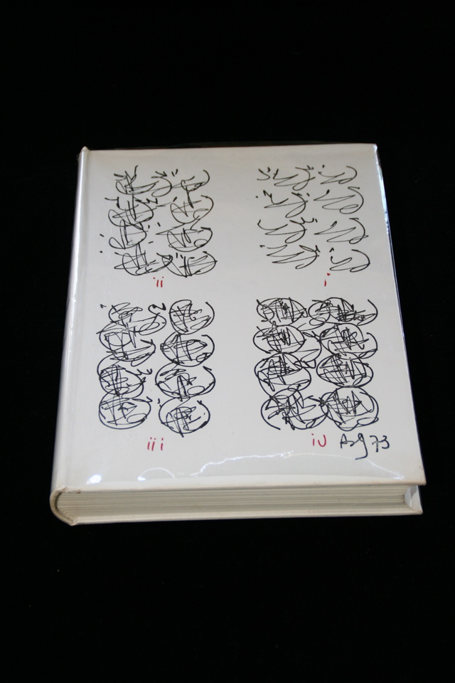

## Barry Miles, Brion Gysin. A Descriptive Catalogue of the William S. Burroughs Archive.

London/Ollon: Covent Garden Press, Ltd./Am Here Books, 1973. Signed by Burroughs, Brion Gysin and Miles. Signed limited edition of 226, this one unlettered and unnumbered. A presentation copy from Brion Gysin to Richard and Lilia Aaron. This copy has a full-page calligraphic drawing by Gysin (similar in form to the one numbered "iv" on the cover of the catalog) on the recto of the leaf before the title page. Signed by Gysin and inscribed "for Lilia + Richard with love." In acetate dust jacket. Schottlaender I6.

