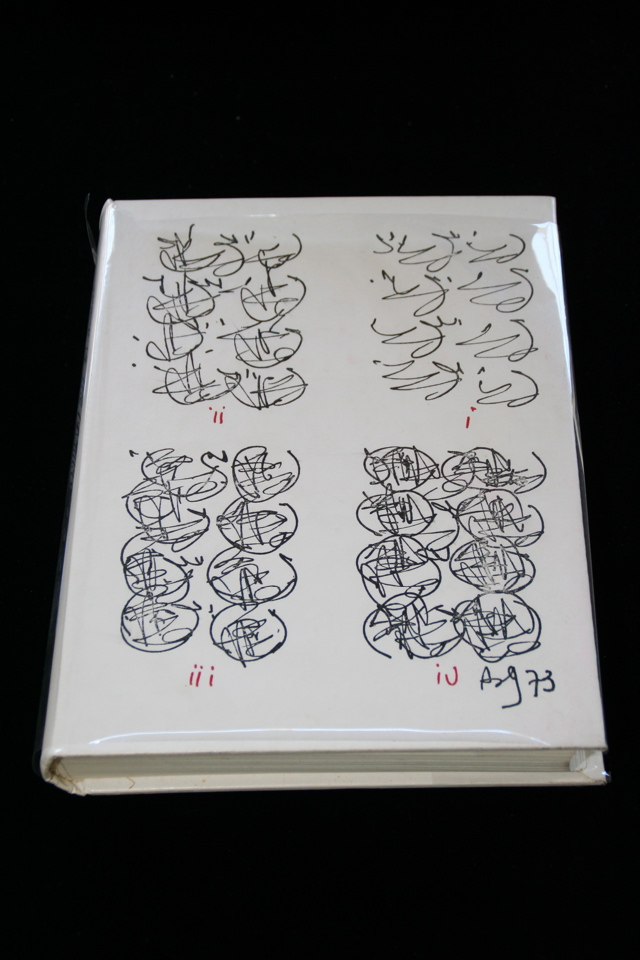

## Barry Miles, Brion Gysin. A Descriptive Catalogue of the William S. Burroughs Archive.

London/Ollon: Covent Garden Press, Ltd./Am Here Books, 1973. Signed by Burroughs, Brion Gysin and Miles. Signed limited edition of 226, this one unlettered and unnumbered. Some foxing to edges, and the top edge of the front of the acetate dust jacket is cut off. Schottlaender I6.

