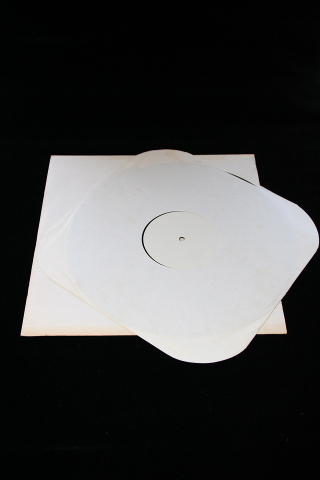

## William S. Burroughs. Ali's Smile - Record.

Brighton, England: Unicorn Books, 1971. First. A copy of the record with sleeve originally supplied with the book. This copy was purchased from a different source than my copy of the book, so there's no evidence that the two constituted a complete set. Since one would expect complete sets to stay together, it is unlikely that they ever were. But together they form a made-up copy. Schottlaender A23a, Maynard & Miles A19a.

