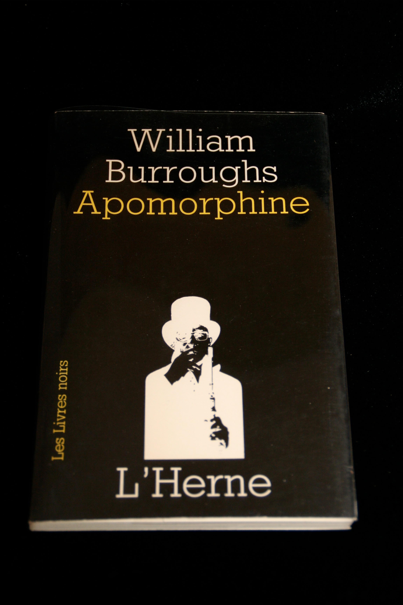

## William S. Burroughs. Apomorphine.

Paris: L'Herne, 1969. First. Per James Musser: "Softbound (no hardbound issued). First edition. Prints "Apomorphine" in it's entirety (in three-column style), as well as "Day the Records Went Up," "Coldspring News," "Parenthetically 7 Hertz," and more. Among the scarcer Burroughs items. Fine. (French text.)" Schottlaender A20, Maynard & Miles D14.

