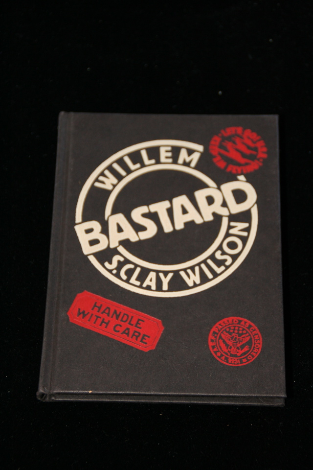

## S. Clay Wilson, Bernard Willem Holtrop. Bastard.

Paris: Futuropolis, 1984. First. Personal copy of Gregory Corso of cartoon collaboration by Willem and Wilson. Signed by Burroughs, Wilson and Gregory Corso (using his Italian name "Nuncio Corso"). Contains endorsement by Burroughs. 

