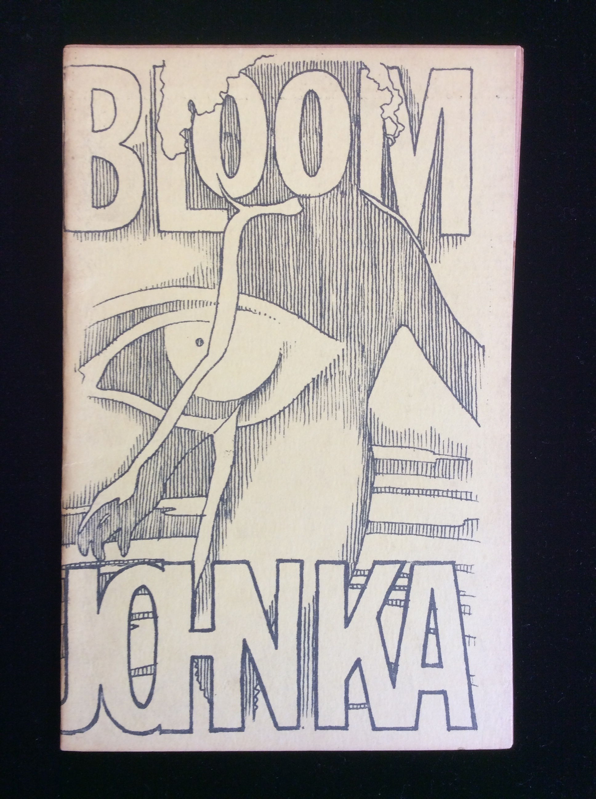

## John Ka, William S. Burroughs, Gregory Corso, Allen Ginsberg, Tuli Kupferberg, Walt Whitman. BLOOM.

Detroit: Artist's Workshop Press, 1967. First edition. Staplebound mimeograph. Per Brian Cassidy: "Scarce book from John Sinclair's Detroit press. Ka illustrates erotic works by Allen Ginsberg, Whitman, William S. Burroughs, Corso, Gary Snyder, Kerouac, Tuli Kupferberg, and others. ... From an edition of 500 copies ... OCLC locates only 5 copies, almost all in Michigan. ... not in Morgan, Maynard & Miles, or McNeil." 

