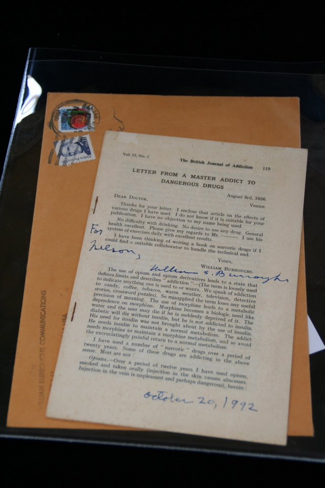

## William S. Burroughs. British Journal of Addiction 53(2).

n.p., 1957-01. Offprint of Burroughs' article "Letter From A Master Addict To Dangerous Drugs." Limited to 50 copies. Signed by Burroughs, inscribed to Nelson Lyon "For Nelson, William S. Burroughs October 20, 1992." With postmarked envelope with William Burroughs Communications return address. Schottlaender C3, Maynard & Miles C1b.

