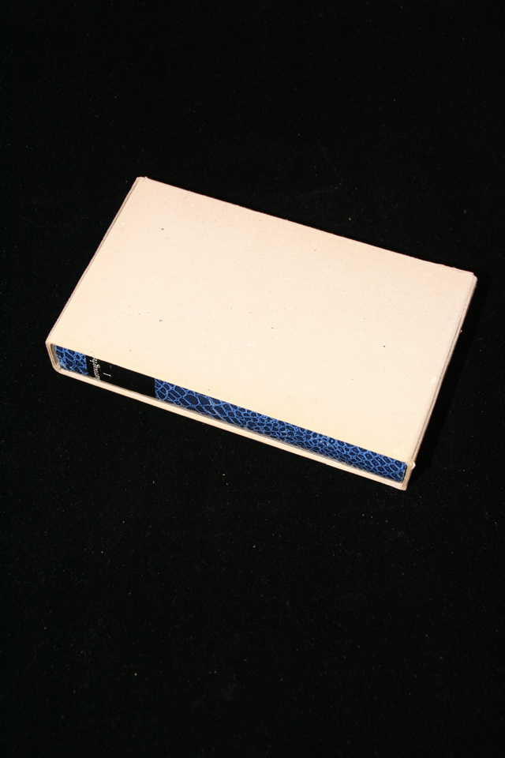

## William S. Burroughs. Burroughs I (Junkie, Auf der Suche nach Yage, Naked Lunch, Nova Express).

Frankfurt: Zweitausendeins, 1978. First. Contains German translations of Junky, the Yage Letters, Naked Lunch and Nova Express. Inscribed by the translator Carl Wiessner: "Dear William &mdash; One of the first copies, fresh from the binder's, to you - Hope you like this book - As ever, Carl". Therefore this is presumably Burroughs' own copy. In cardboard slipcase. Schottlaender D44, D68, D87, and D145.

