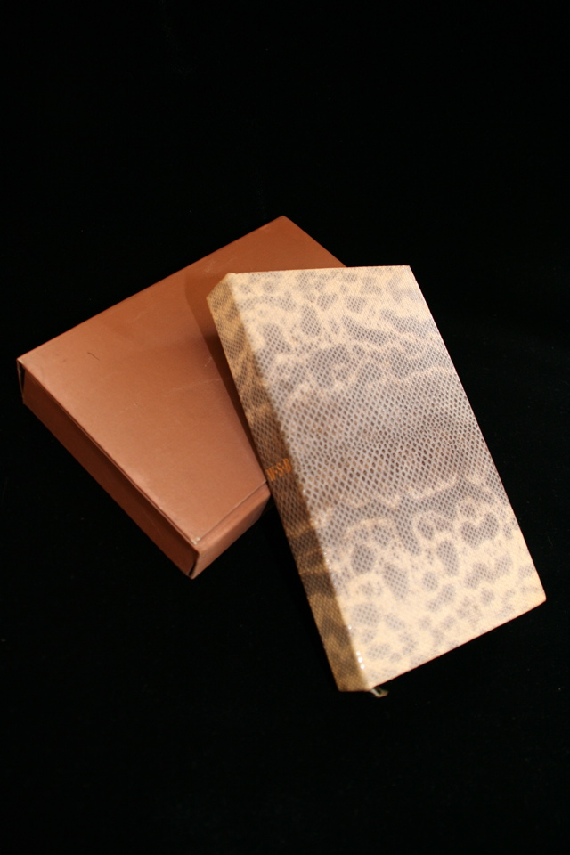

## William S. Burroughs. Burroughs II (Die wilden Boys, Port of Saints).

Frankfurt: Zweitausendeins, 1980. First. Per James Musser: "The first German edition of The Wild Boys (and presumably first German Port of Saints).  Tipped-in frontis illustration by S. Clay Wilson whose full-page plates appear throughout the book.  BURROUGHS' PERSONAL COPY SPECIALLY BOUND for him by the publisher in DIAMONDBACK RATTLESNAKE SKIN with Burroughs' initials stamped to the spine. Signed on the title page by Burroughs and also by S. Clay Wilson who dated his signature 1996.  (Wilson's person copy was bound in Niger goat and snakeskin--so depending on how you look at it each copy is unique---or you can say there were two specially bound author copies bound by the publisher.)  Fine in slightly used slightly soiled folding chemise covered in the same silk they used for the endpapers." Schottlaender D98 and D137.

