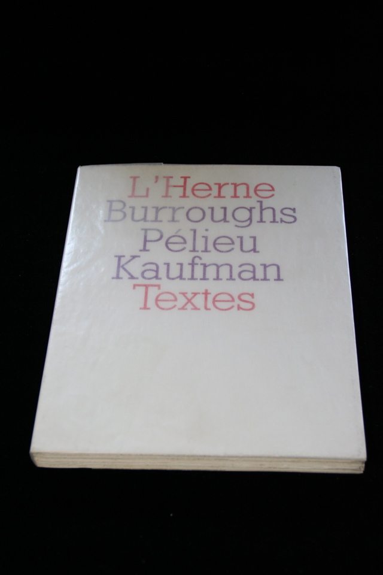

## William S. Burroughs. Burroughs Pelieu Kaufman.

Paris: L'Herne, 1967. First. Number 33 of 40. With uncut pages and with signed and numbered lithograph by Jean Helion laid in. Schottlaender A18a, Maynard & Miles D11.

