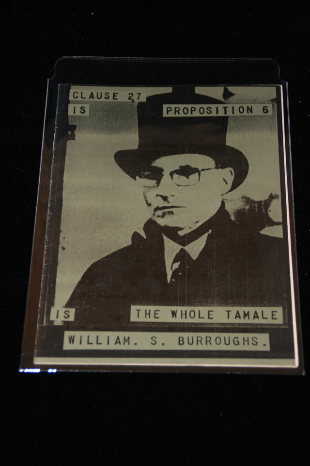

## William S. Burroughs. Clause 27 Is Proposition 6 Is The Whole Tamale.

n.p.: The Horse Press, 1989. First. Signed by Burroughs "William S. Burroughs 1/23/1997". Year of publication approximate per Shoaf and Schottlaender. Schottlaender A63.

