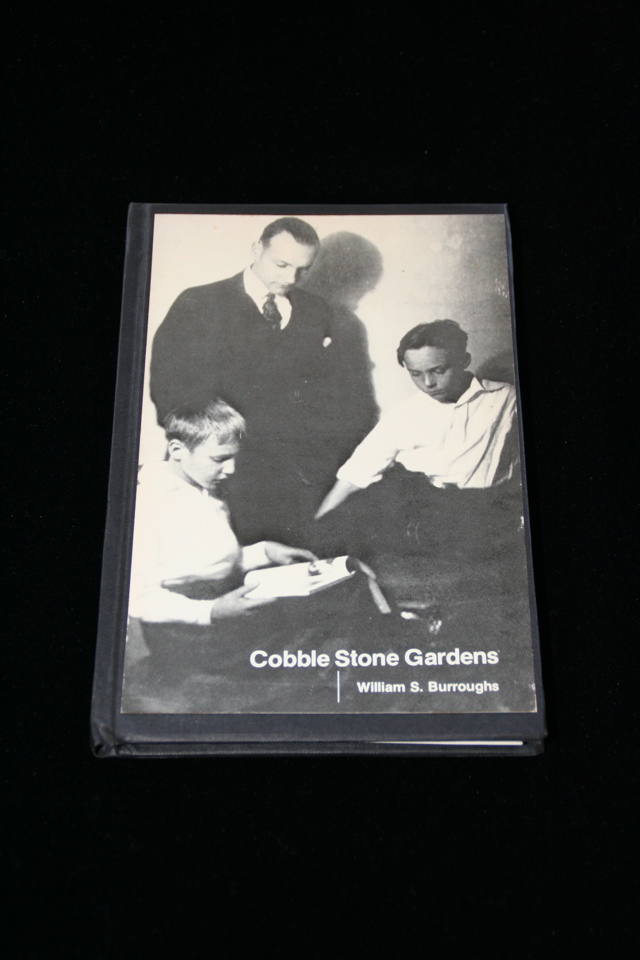

## William S. Burroughs. Cobble Stone Gardens.

Cherry Valley, NY: Cherry Valley Editions, 1976. First. One of 50 hand bound copies signed by Burroughs, but mysteriously unnumbered in spite of publisher's statement to the contrary. Bound in boards with black cloth and front wrapper pasted on front, with binding somewhat loose. Schottlaender A34.

