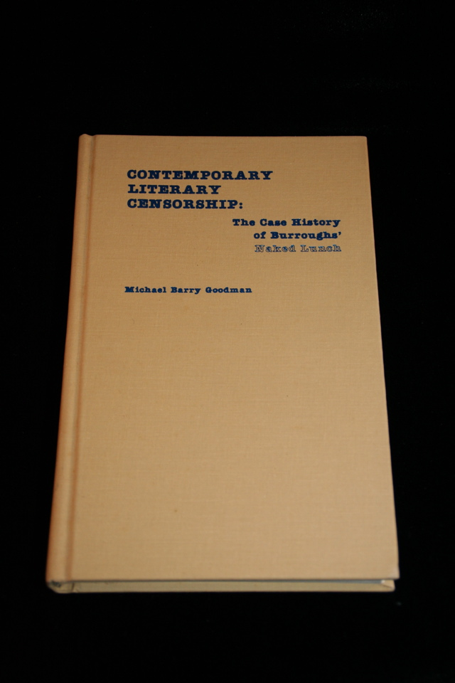

## Michael B. Goodman. Contemporary Literary Censorship: The Case History of Burroughs' Naked Lunch.

Metuchen, NJ : Scarecrow Press, 1981. First. Critical study by Michael Barry Goodman. Signed by the author. Schottlaender I22.

