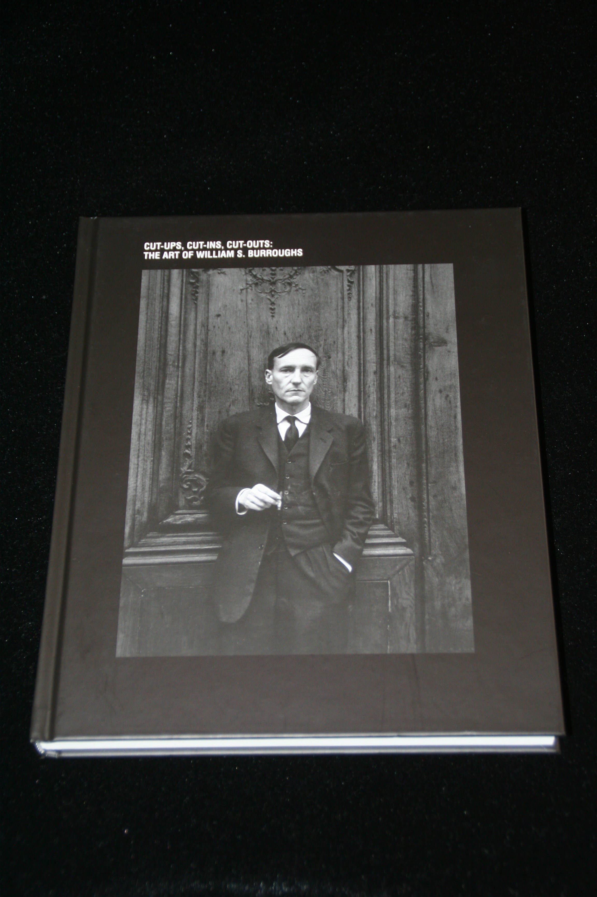

## Tim Head, C.A. Howe, Barry Miles, Jon Savage. Cut-ups, Cut-ins, Cut-outs: The Art of William S. Burroughs.

Nürnberg: Verlag für moderne Kunst; Wien: Kunsthalle Wien, 2012. First. Schottlaender B29.

