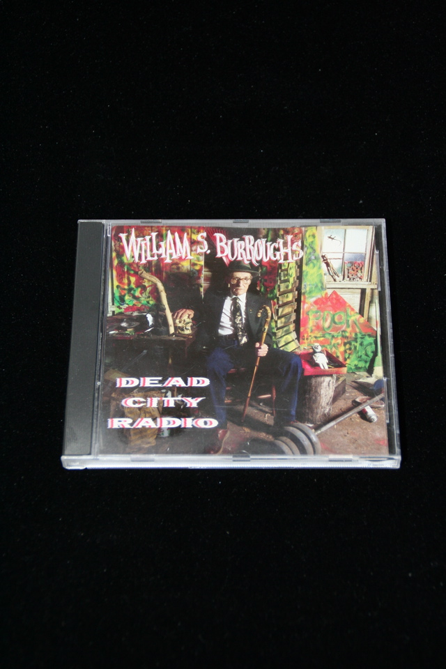

## William S. Burroughs. Dead City Radio.

New York: Island Records, Inc., 1990. Single CD, 17 tracks of readings from various works, with various backing musicians. Produced by Nelson Lyon, who became a good friend of Burroughs and amassed a significant collection of Burroughs and Beats material, sold at auction in 1999, and some items of which have found their way into my collection. Schottlaender E7.

