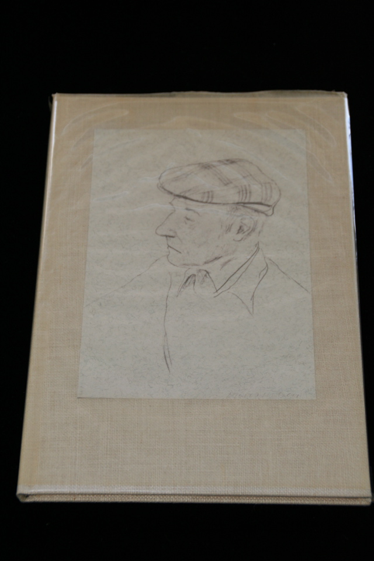

## William S. Burroughs. Early Routines.

Santa Barbara, CA: Cadmus Editions, 1981. First. Signed by Burroughs and David Hockney, who did Burroughs' portrait on front cover. Lettered Q of 26, in rice paper dust jacket. Schottlaender A48a.

