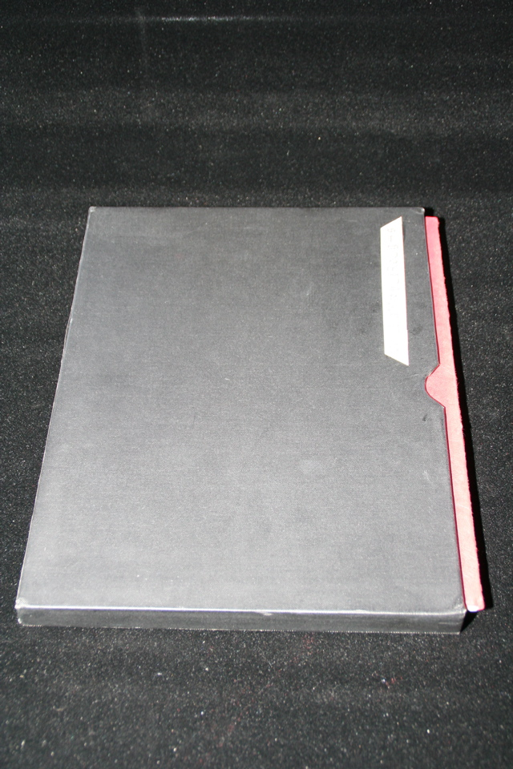

## William S. Burroughs. Electronic Revolution.

Cambridge: Blackmoor Head Press, 1971. First. Includes four prints signed by Brion Gysin and publisher's prepublication announcement (Maynard and Miles F27) laid in. Inscribed by Burroughs "for Philip Kaplan Williams Burroughs." Number 10 of 50. In slipcase with numbered label. Schottlaender A24a, Maynard & Miles A21a.

