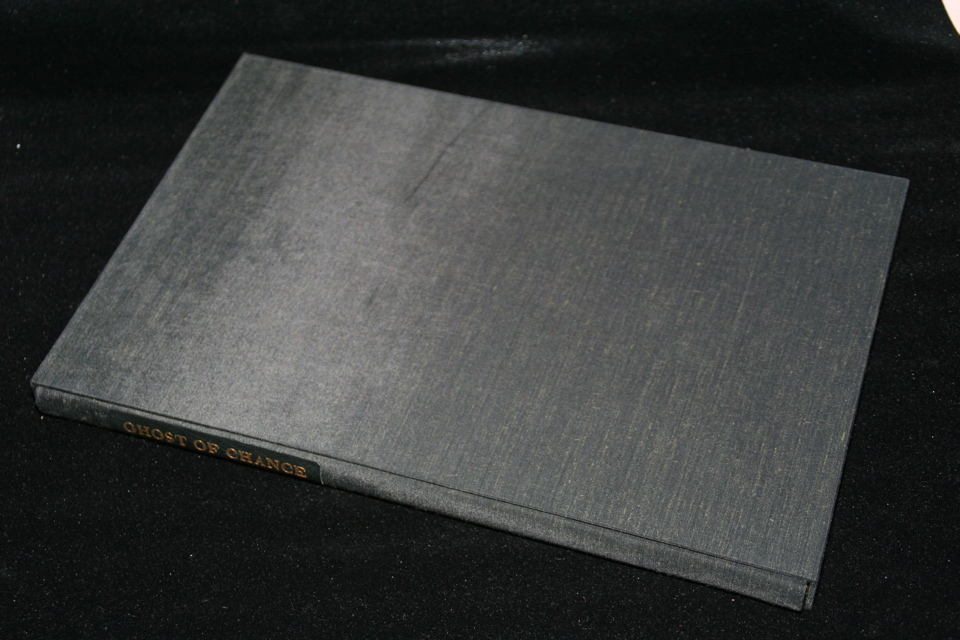

## William S. Burroughs. Ghost of Chance.

New York: Whitney Museum of Art, 1991. First. Signed by Burroughs and George Condo, the illustrator. Unnumbered, one of 160, in slipcase. Schottlaender A66a.

