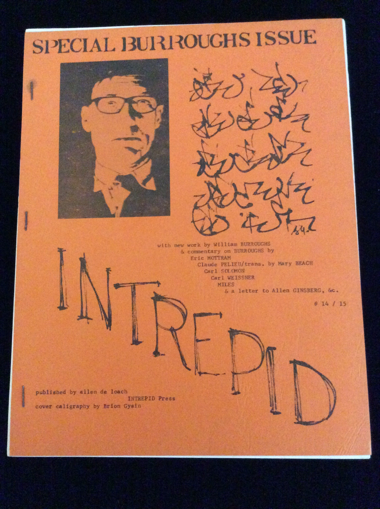

## William S. Burroughs, Allen De Loach, Eric Mottram, Claude Pelieu, Carl Solomon, Carl Weissner, Barry Miles, Duncan McNaughton, Brion Gysin. Intrepid 14/15.

Buffalo, NY: Intrepid Press, 1969. Per Brian Cassidy: "4to. Illustrated stiff wraps. Near fine. Trace soil to front cover. Internally fine. Bright, clean. Good and sound. 103pp. Special issue of De Loach's lit mag. Features contributions from Burroughs, Eric Mottram, Claude Pelieu, Carl Solomon, Carl Weissner, Barry Miles, and others." Schottlaender C234, Maynard & Miles C256, C257, C258, C259, C260, C261, C262, C263, and C264.

