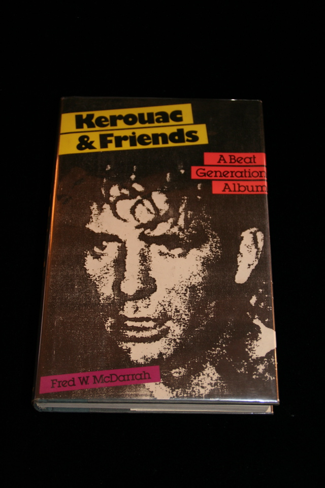

## Fred McDarrah. Kerouac & Friends - A Beat Generation Album.

New York : W. Morrow, 1985. First. Signed by the author and the following Beat Generation figures: Ted Joans, Herbert Hunke, Carl Solomon, Jack Micheline, Diane di Prima, Gregory Corso and Allen Ginsberg. 

