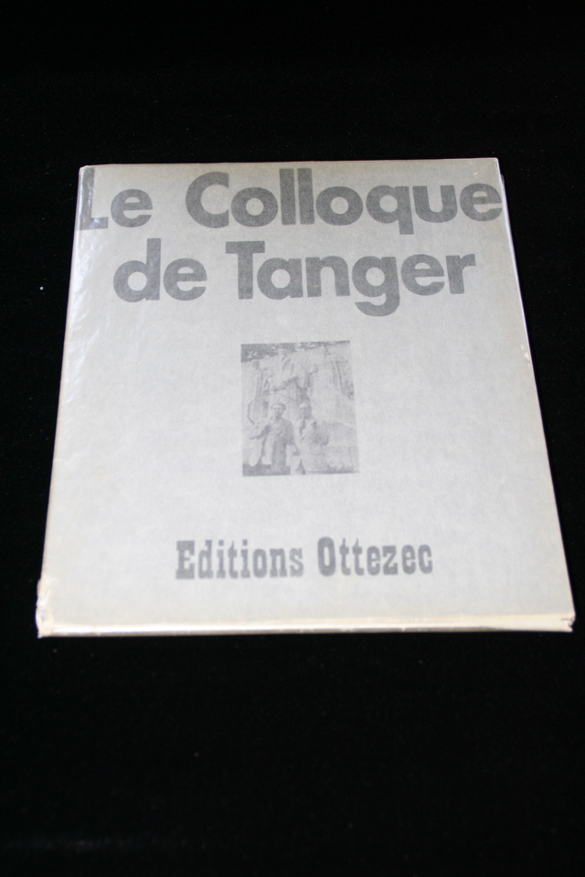

## Francois Legarde. Le Colloque de Tanger.

Geneva: Editions Ottezec, 1976. Ten black and white photos of Burroughs and Brion Gysin taken during the Colloque de Tanger symposium. Signed by Burroughs, Gysin, Francois Legarde (the photographer) and Gerard-Georges Lemaire (the symposium's organizer.) Number 19 of 75. Tear and wear to lower left corner of printed folder. Schottlaender G45a.

