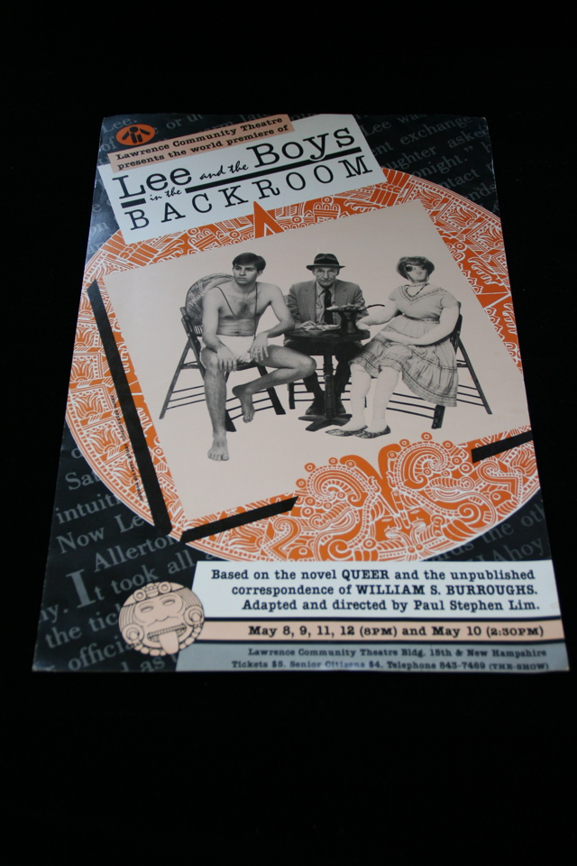

## Paul Steven Lim. Lee and the Boys in the Backroom.

Lawrence, KS: Lawrence Community Theatre, 1987. Poster announcing "Lee and the Boys in the Backroom," "a play "based on the novel QUEER and the unpublished correspondence" of WILLIAM S. BURROUGHS at Lawrence Community Theatre May 8 - 12,"  directed by Paul Lim, a professor of English at the University of Kansas and one of Burroughs' friends in Lawrence. Picture of Burroughs seated with "boy" and life-sized doll at a table with Mexican food. Schottlaender G50b.

