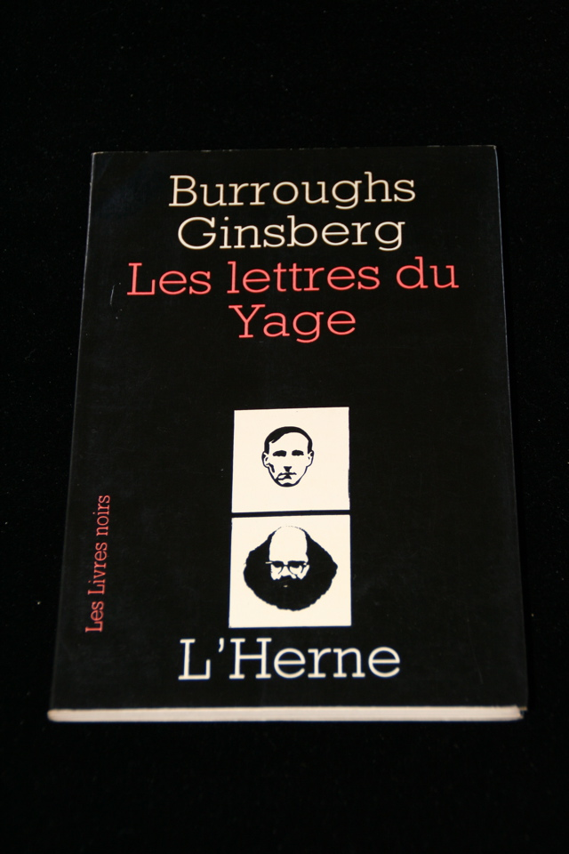

## William S. Burroughs, Allen Ginsberg. Les lettres du Yage.

Paris: L'Herne, 1967. First French. Presentation copy  inscribed by Burroughs "For Mary Beach and Claude Pelieu William Burroughs" , also signed by Allen Ginsberg "Allen Ginsberg Ah." Schottlaender D143, Maynard & Miles D10.

