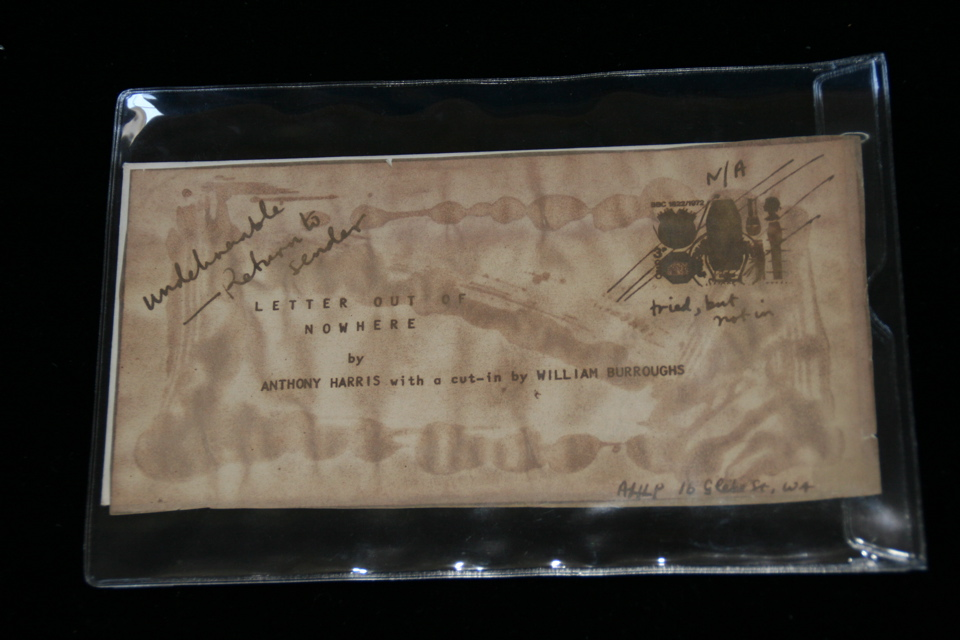

## William S. Burroughs. Letter Out Of Nowhere.

London: Anthony Harris, 1971. First. Per James Musser: "Single sheet (done in the style of a letter) printing a cut-up by Burroughs of a Harris text.  Enclosed in a mailing envelope.  Slightly darkened from age, else fine (trivial wear to envelope)." Schottlaender G30.

