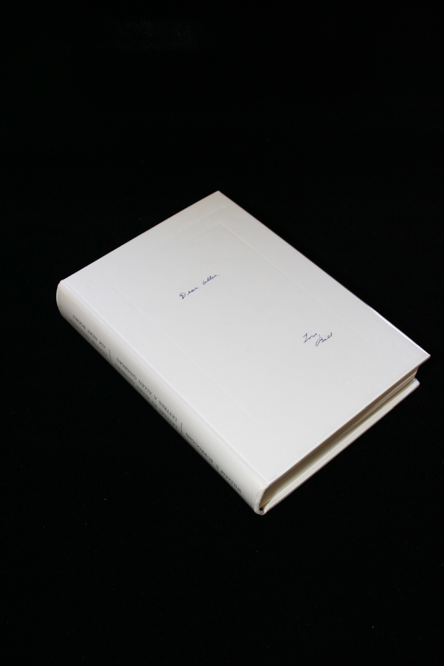

## William S. Burroughs. Letters to Allen Ginsberg 1953 - 1957.

Geneva: Claude Givaudan/Am Here Books, 1978. First. Signed by Burroughs and Allen Ginsberg, number 18 of 100 of a bilingual French-English version. In clear acetate dust jacket with some damage to the upper rear edge. Schottlaender H12a.

