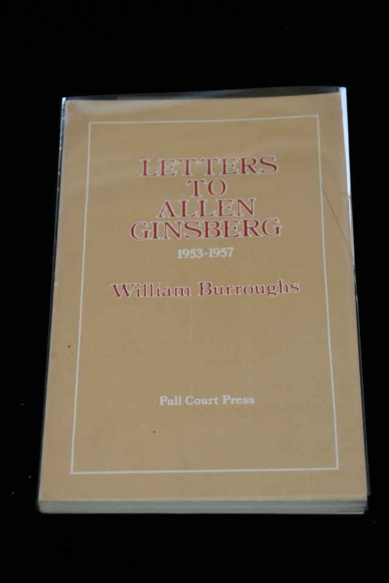

## William S. Burroughs. Letters to Allen Ginsberg 1953 - 1957.

New York: Full Court Press, 1982. First American in wrappers. Personal copy of Peter Orlovsky, signed by Orlovsky and inscribed by Burroughs "For Peter all the best Letters Love William S. Burroughs June 7, 1982."  Slight pencil mark on front cover. Schottlaender H12c.

