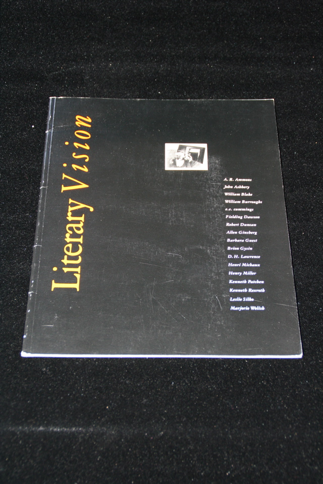

## William S. Burroughs, James Grauerholz. Literary Vision.

New York: Jack Tilton Gallery, 1989. Perfect-bound brochure accompanying showing of painting by noted literary figures, including Burroughs and Gysin, at Jack Tilton Gallery, New York. With excerpts from Grauerholz's essay "On Burroughs' Art". 

