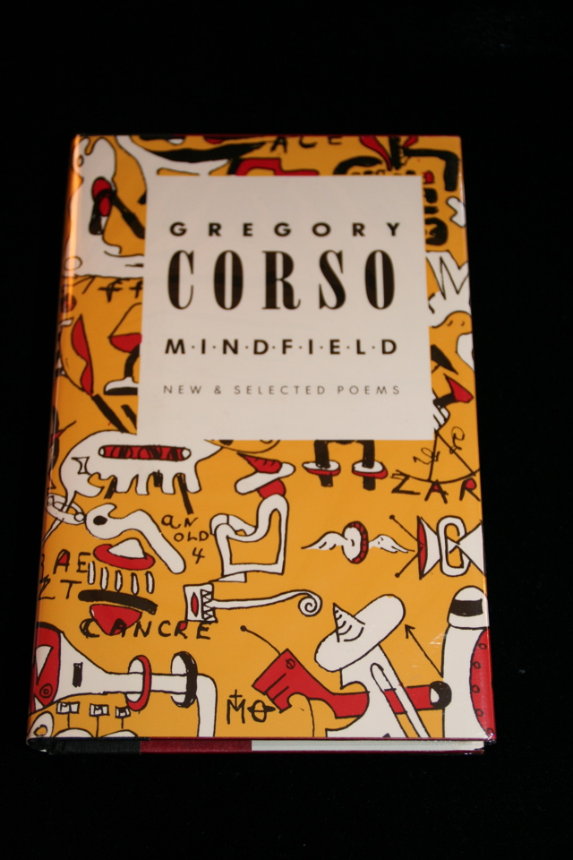

## Gregory Corso. Mindfield.

New York: Thunder's Mouth Press, 1989. First. A book of poems by Gregory Corso, with forwards by Burroughs and Allen Ginsberg. Letter O of a limited edition of 26 signed by the author, as well as Burroughs and Ginsberg. As issued in red slip case. 

