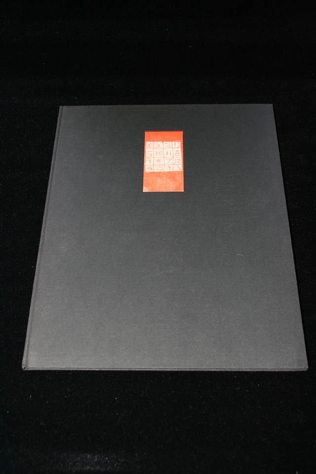

## William S. Burroughs. Mummies.

Dusseldorf & New York: Edition Kaldeway, 1982. First. Contains 5 prints of etchings signed by the artist, Carl Apfelschnitt. Half-title reads: "Edition: Volume 5". Colophon reads: "Printed in 70 copies and 5 copies on [sic] Japan. Bound by Christian Zwang, Hamburg. Typography Gunnar A. Kaldewey. First Edition. Copyright William Borroughs [sic] 1982." Some scuffing to front cover. Schottlaender A51.

