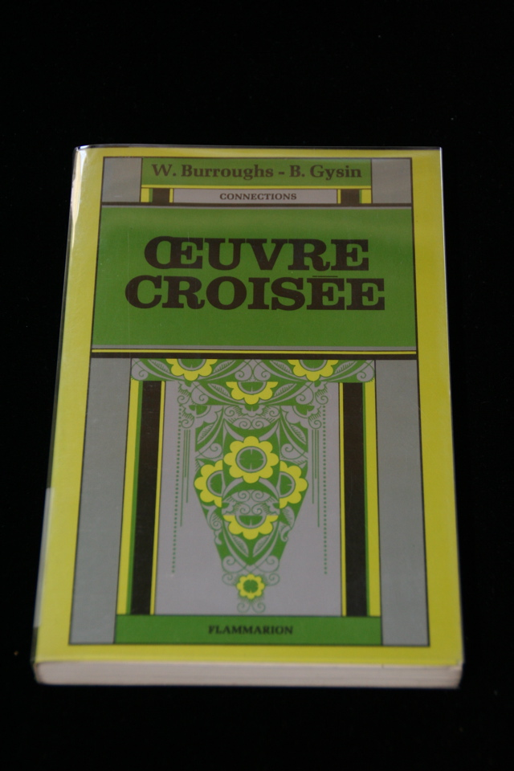

## William S. Burroughs. Oeuvre Croisee.

Paris: Flammarion, 1976. First French. The true first edition of "The Third Mind." Signed by Brion Gysin, inscribed "with best wishes Brion Gysin Paris 15 aug 81". Schottlaender A36a.

