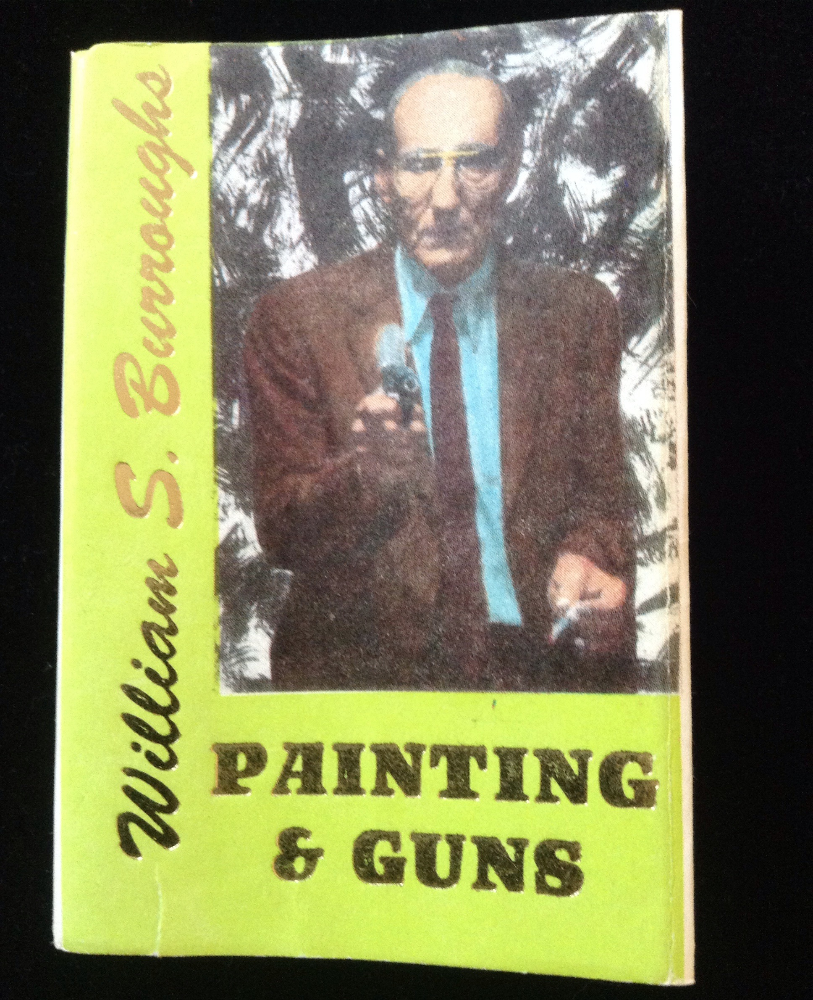

## William S. Burroughs. Painting & Guns.

Madras, India and New York, NY: Hanuman Books, 1992. First. In cream wrappers. Cover variant with monkey face surrounded by half circle on back, price tag on back, small tear to lower front. Schottlaender A67.

