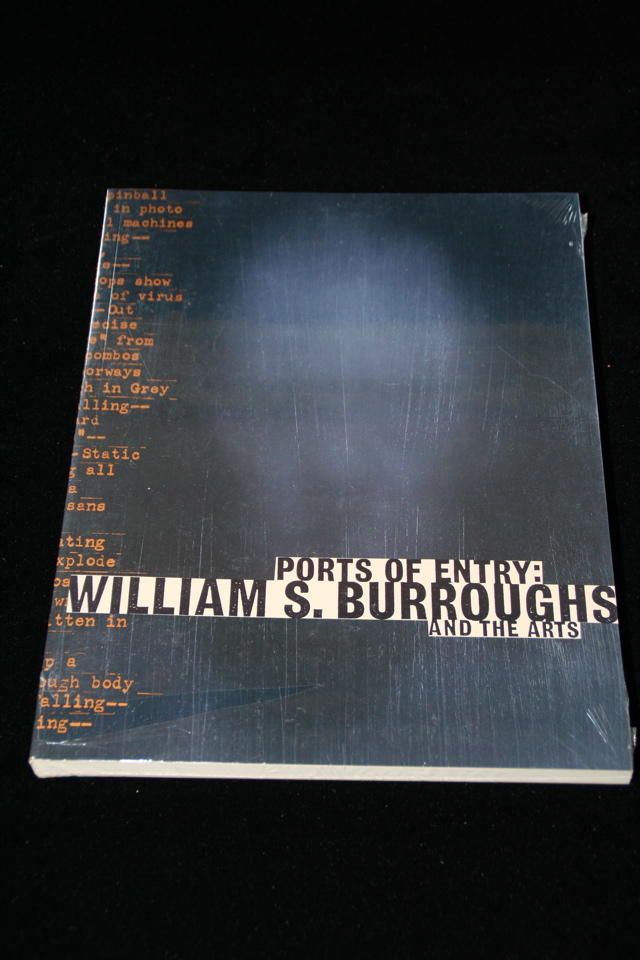

## Robert A. Sobieszek. Ports of Entry: Williams Burroughs and the Arts.

Los Angeles, CA: Los Angeles County Museum of Art , 1996. First. Produced for a 1996 exhibition at LACMA. Mint in original shrinkwrap. Schottlaender B23a.

