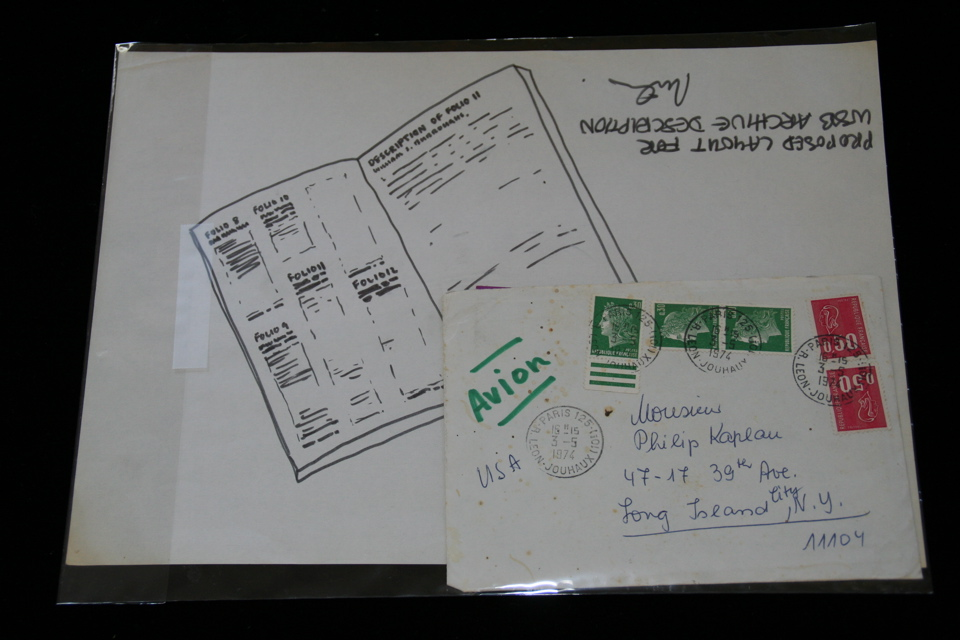

## Barry Miles. Proposed Layout For WSB Archive Description.

n.p., 1973. Drawing by Barry Miles titled "Proposed Layout For WSB Archive Description", in reference to the "A Descriptive Catalogue of the William S . Burroughs Archive,". Drawing signed by Miles. Together with a letter and stamped envelope from Roberto Altmann to Philip Kaplan discussing a question about publishing matters at Altmann's Aperios imprint, and a 1974 New's Year greetings card from Maggy and Roberto Altmann, with artwork signed "MA." 

