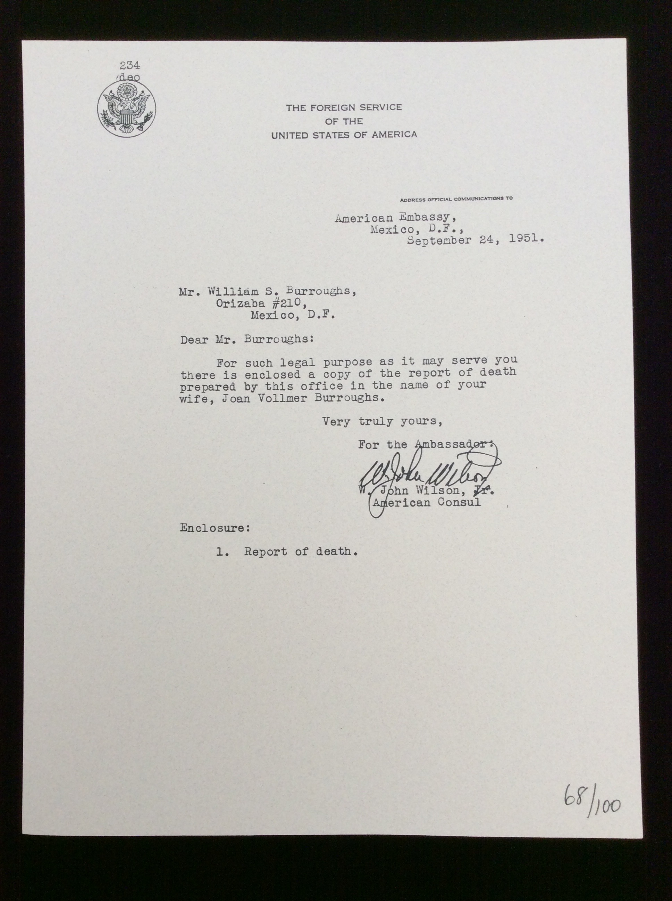

## Water Row Books. Report of the Death of an American Citizen ... Mexico, D.F., Mexico, September 24, 1951 ...Joan Vollmer Burroughs .../.

Marlborough, MA: Water Row Books, 1995. First. Broadside, numbered 68 of 100. Schottlaender G1.

