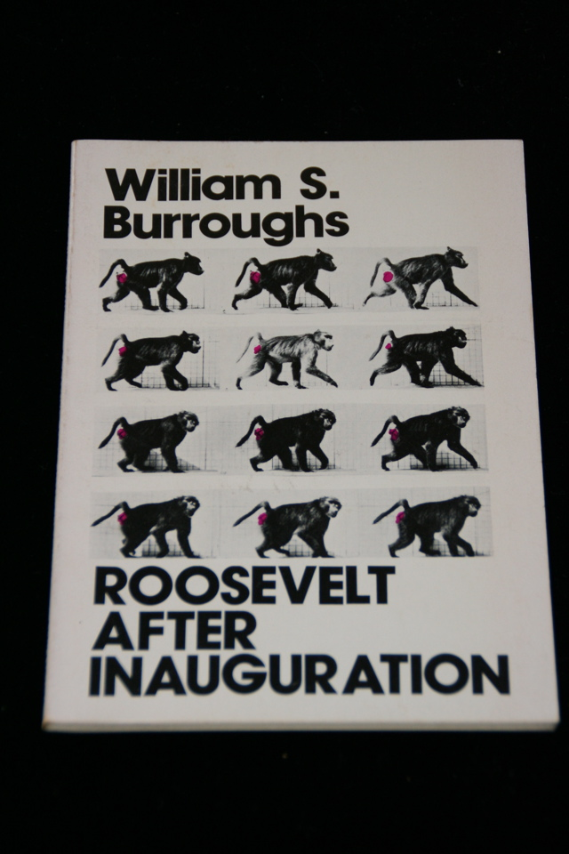

## William S. Burroughs. Roosevelt After Inauguration.

San Francisco: City Lights Books, 1979. First edition thus in wrappers. Reprint in wrappers, with "Sects and Death", "The Whole Tamale", and "When Did I Stop Wanting To Be President?" Schottlaender A43.

