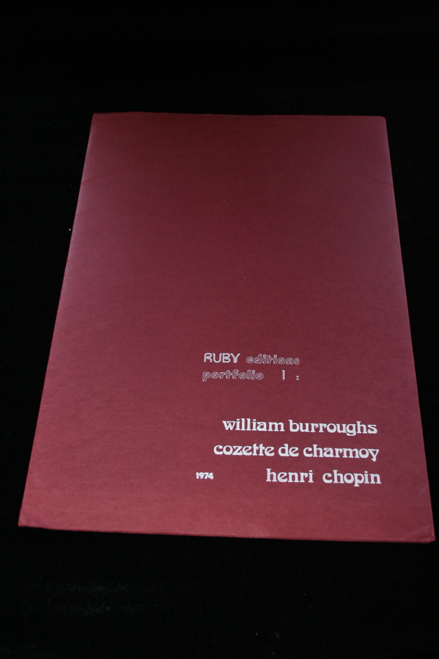

## Henri Chopin, Cozette de Charmoy, William S. Burroughs. Ruby Editions Portfolio 1.

London and Toronto: Wallrich Books, 1975. First. Signed by Burroughs on his contribution "Une Poeme Moderne", number 18 of 100. Also contains broadsides by Cozette de Charmoy and Henri Chopin. Tape has lost adhesive on portfolio folder. Schottlaender B2.

