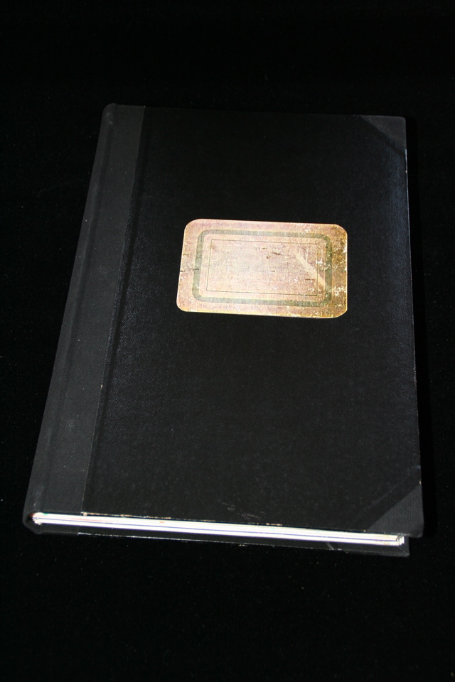

## William S. Burroughs. Scrapbook 3.

Geneva: Editions Claude Givaudan, 1979. First. Signed by Burroughs, number 27 of 30. Plate on inside back cover reads: "This first edition, printed in Xerox copies by Claudia Katayanagi and Patrick R. Firbo, Great White Way Kinetics, New-York, in January 1979, has been printed at 30 numbered copies." and "Copyright Editions Claude Givaudan 3, Rue de Soleil Levant, Geneva". Schottlaender A44.

