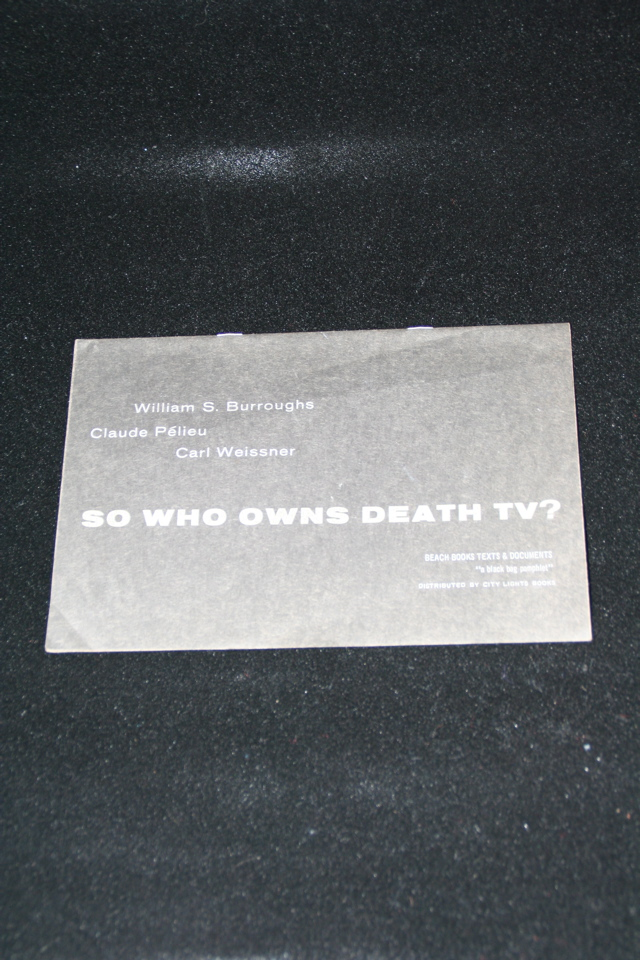

## William S. Burroughs. So Who Owns Death TV?.

San Francisco: Beach Books, Texts and Documents, 1967. First (variant). Some creasing in lower left hand corner and close to spine. Schottlaender A17a, Maynard & Miles A13a.

