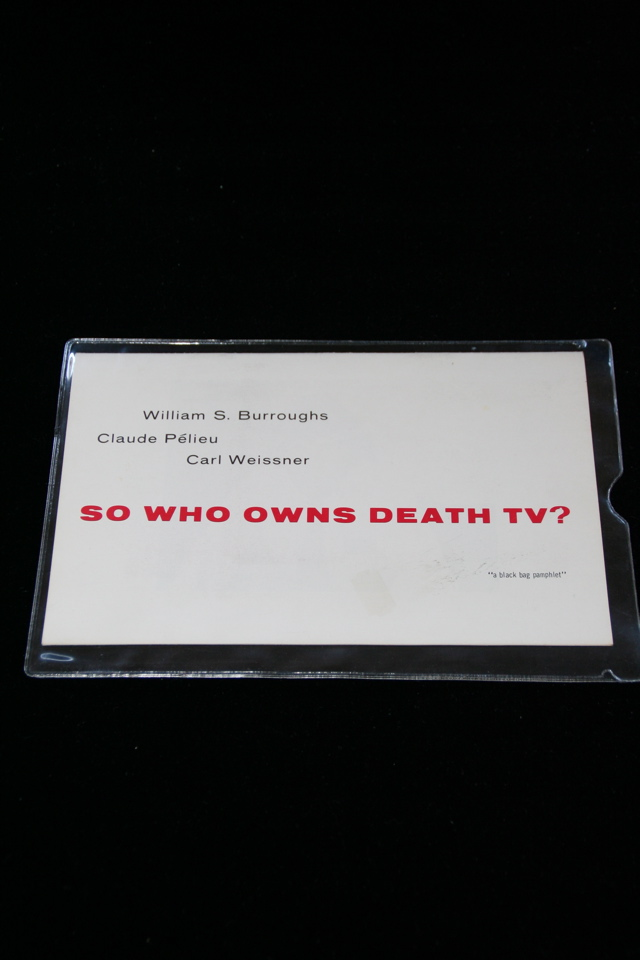

## William S. Burroughs. So Who Owns Death TV?.

San Francisco: Beach Books, Texts and Documents, 1967. Second. Slight evidence of price sticker removal on front wrapper. Schottlaender A17b, Maynard & Miles A13b.

