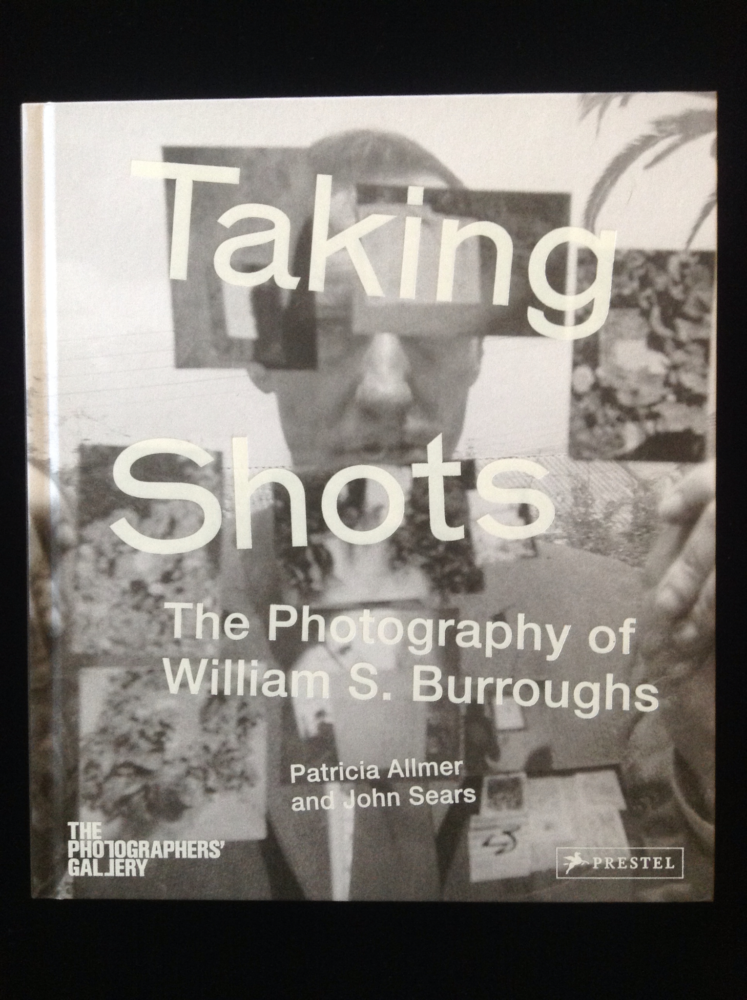

## Patricia Allmer, John Sears. Taking Shots: The Photography of William S. Burroughs.

Munich, DE: Prestel Verlag, 2014. First. Edited by Patricia Allmer and John Sears. Produced for an exhibition of Burroughs' photographic work in 2014 at The Photographers' Gallery in London. Schottlaender B30.

