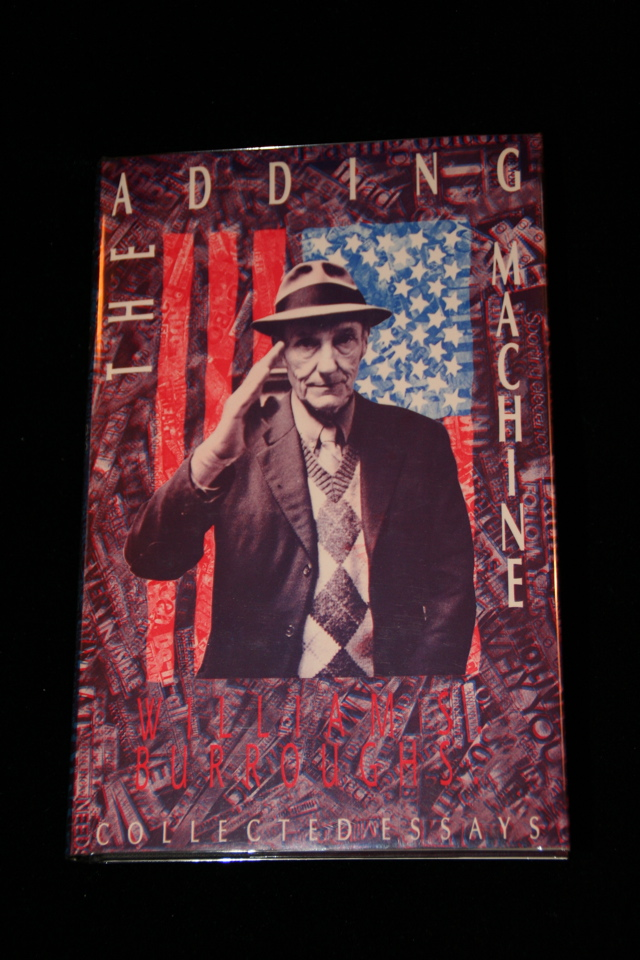

## William S. Burroughs. The Adding Machine.

London: John Calder, 1985. First. Per the London bookseller Any Amount of Books: "From the working library of novelist Angela Carter (1940 - 1992) with her posthumous bookplate. This small, attractive bookplate reads 'From the Library of Angela Carter' and was designed by Sebastian Carter of the Rampant Lions Press and was authorised by the executors of her estate, from whom we bought the major part of her considerable collection. Fine in fine dust wrapper." Schottlaender A58a.

