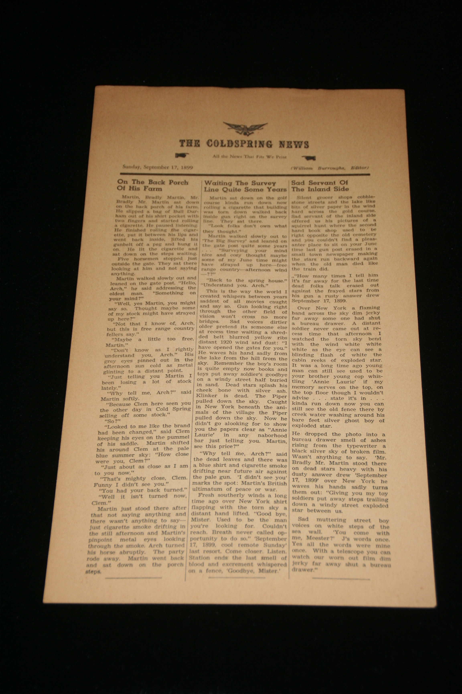

## William S. Burroughs. The Coldspring News.

Flint, MI: Fenian Head Centre Press, 1964. First. Per Brewer's Books: "This is one of the separately issued copies with no fold creases. Newsprint very tanned penciled price in upper right hand corner as it was sold in some bookstores in the '60's for ten cents each. ... No copyright at lower edge which according to Maynard and Miles (C124c) means it is a 'later state' ..." Schottlaender A9, Maynard & Miles C124c.

