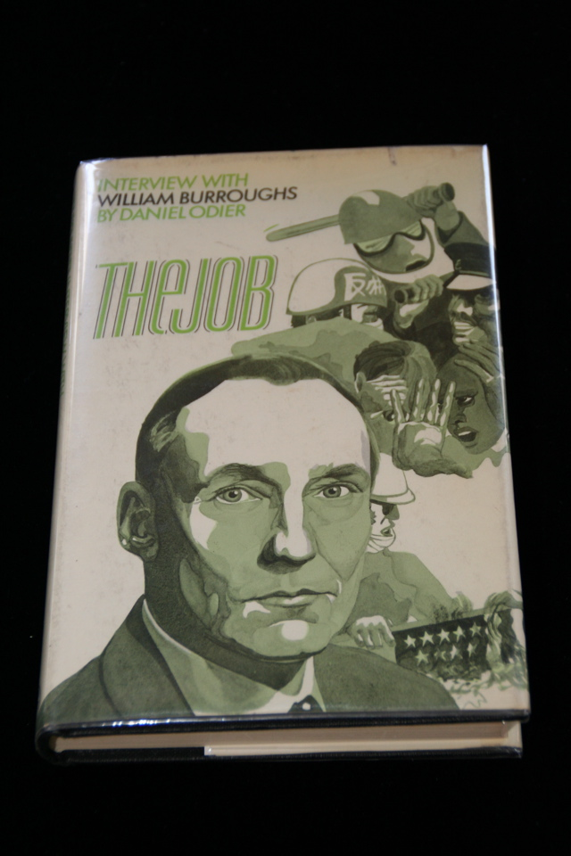

## Daniel Odier, William S. Burroughs. The Job.

London: Jonathan Cape, 1970. First English. Personal copy of Allen Ginsberg, signed by Ginsberg and Burroughs. Inscribed by Burroughs on title page "For Allen a co worker of many years with respect for his achievements in the cause of freedom William Burroughs 1980". Ownership signature of Ginsberg on obverse of leaf before title page, with notation at bottom "Signed June 12, 1980 by WSB." Publisher's slip ("with compliments from Tom Maschler Jonathan Cape Ltd. 30 Bedford Square London SW1") and postcard (with picture of Ginsberg and Peter Orlovsky copyright Elsa Dorfman and the Witkin Gallery) laid in. Schottlaender H9c, Maynard & Miles A16b.

