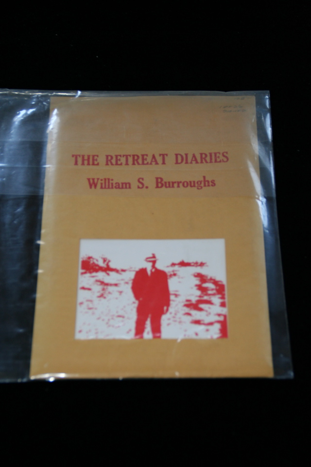

## William S. Burroughs. The Retreat Diaries.

New York: The City Moon, 1976. First. Signed and lettered by Burroughs, I (or possibly L?) of 26. As issued in brown paper envelope with cutaway section exposing red-on-white image of Burroughs, on front wrapper, with Burroughs' lettering for title on front wrapper. Schottlaender A35.

