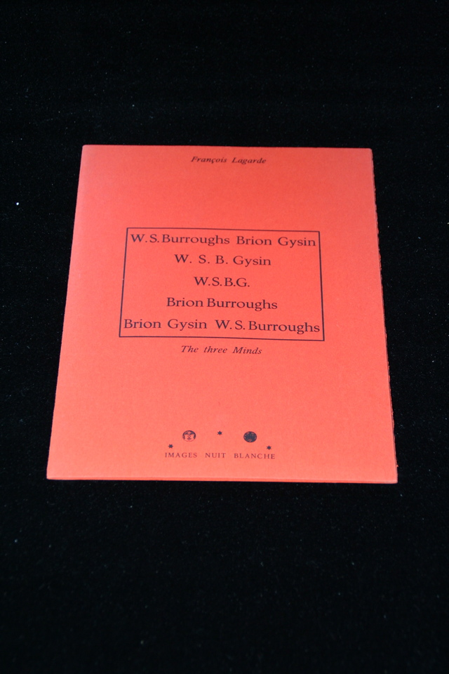

## Francois Legarde. The Three Minds.

Geneva: Images Nuit Blanche, 1978. First. A triptych of photographs made by Francois Legarde, with a photo of Burroughs on the right panel, Brion Gysin on the left, and a superimposed image of the two in the center. With folded insert, signed by Burroughs, Gysin and Legarde, number 17 of 35. In orange cardboard mounting. Schottlaender G46.

