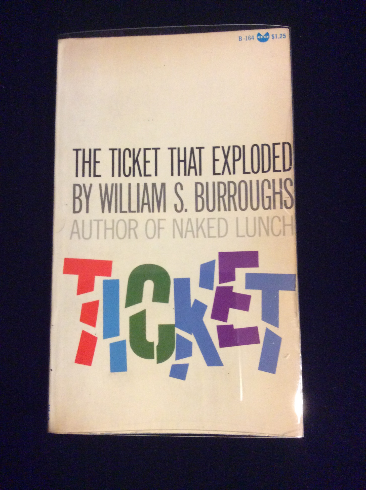

## William S. Burroughs. The Ticket That Exploded.

New York: Grove Press, Inc., 1968. Second printing. Inscribed by Burroughs on title page “For Richard Aaron William S. Burroughs." Per Ken Lopez, at one time this was in the collection of Robert and Donna Jackson: "Jackson, a book collector long before he purchased Burroughs' papers, also acquired a number of other copies of Burroughs titles, including ... another group inscribed to Richard Aaron, the bookseller who had helped facilitate the sale of the [Vaduz] archive." Schottlaender A6c, Maynard & Miles A6c.

