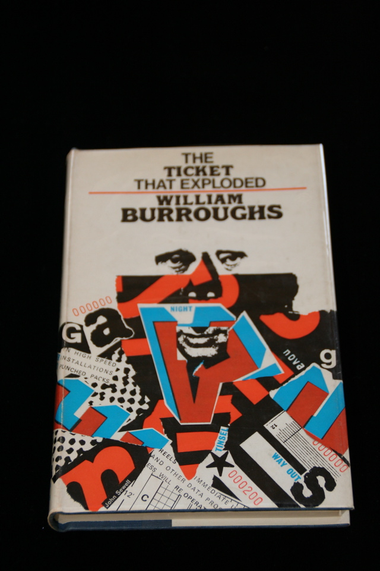

## William S. Burroughs. The Ticket That Exploded.

London: Calder & Boyars, 1968. First English. Signed by Burroughs, inscribed "For Brad".  I obtained this item from Red Stodolsky of Baroque Books in Hollywood in the late Eighties; I remember Red smiling gnomically when he handed it to me, as if he'd arranged to get it inscribed for me, but I have no real proof that that was the case. Slight tear and rubbing on spine of dust jacket. Schottlaender A6d, Maynard & Miles A6d.

