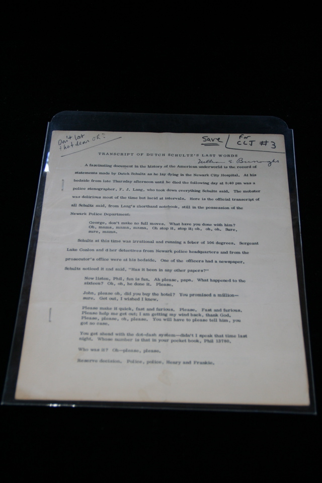

## William S. Burroughs. Valentine's Day Reading.

New York: The American Theatre for Poets, 1965. First. Per James Musser: "Program distributed on the occasion of Burroughs' appearance at the East End Theatre in New York, 1965, for a Valentine's Day reading sponsored by The American Theatre for Poets.  Prints "Transcript of Dutch Schultz's Last Words" and "The Coldspring News."  This is Lawrence Ferlinghetti's copy with the notation "Save for CLJ #3" in Ferlinghetti's hand.  Ferlinghetti was apparently going to include this piece in City Lights Journal #3, but decided against it.  Signed by William Burroughs." These are pages 1 through 6, lacking the cover sheet and page 7 ("The Coldspring News"). Schottlaender A16, Maynard & Miles F12.

