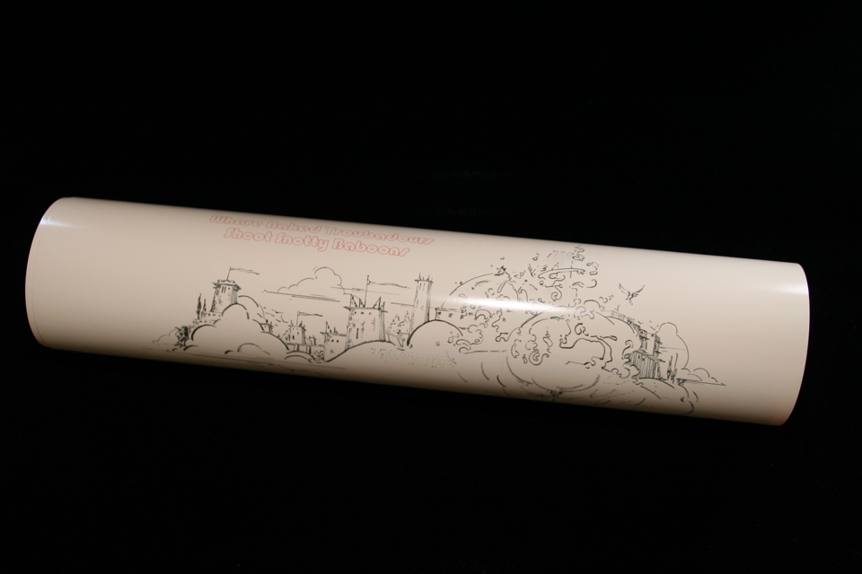

## William S. Burroughs. When Naked Troubadours Shoot Snotty Baboons.

Northridge, CA: Lord John Press, 1978. First. Signed and numbered by Burroughs, number 99 of 100. Broadside, 14x20", designed and illustrated by James R. Silke, also signed by him. Schottlaender A39.

